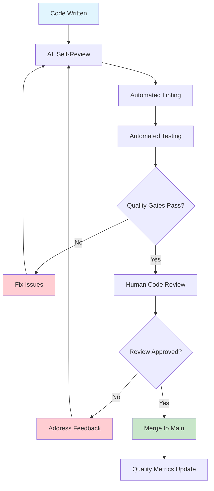
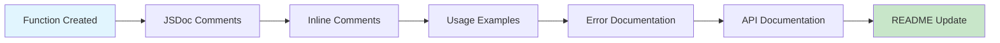

# Code Quality Strategy

This document outlines comprehensive code quality standards and practices for small-to-medium applications (50-100 users) with AI-assisted development. The focus is on maintainable, well-documented code that follows consistent standards.

**Related Documents:**
- `coding_principles.md` - Core development principles and AI collaboration protocols
- `TESTING_STRATEGY.md` - Quality assurance through comprehensive testing
- `SECURITY_STRATEGY.md` - Security code review and secure coding practices
- `ERROR_RESILIENCE_STRATEGY.md` - Error handling and code resilience patterns
- `DEPLOYMENT_STRATEGY.md` - Code quality gates in CI/CD pipeline
- `TECHNICAL_DESIGN_STRATEGY.md` - Code architecture and design decisions
- `FUNCTIONAL_DESIGN_STRATEGY.md` - Code alignment with functional requirements

**Core Principle:** Code should be self-documenting, consistent, and maintainable. Every piece of code should be annotated and understandable by both humans and AI assistants.

## Code Quality Philosophy

### 1. **Code as Communication**
- **Principle**: Code is written for humans to read and understand, not just for computers to execute
- **Implementation**: Clear naming, comprehensive comments, consistent formatting
- **AI Benefit**: Well-documented code provides better context for AI-assisted development
- **Maintenance**: Future developers (including AI) can quickly understand and modify code

### 2. **Consistency Over Cleverness**
- **Principle**: Consistent, predictable code patterns are better than clever, hard-to-understand solutions
- **Implementation**: Established coding standards, automated formatting, pattern libraries
- **AI Alignment**: Consistent patterns help AI understand and replicate code structure
- **Team Benefit**: Reduces cognitive load and onboarding time for new team members

### 3. **Comprehensive Annotation**
- **Principle**: All code must be thoroughly annotated with comments explaining purpose, logic, and context
- **Implementation**: Function documentation, inline comments, architectural notes
- **AI Requirement**: Annotations provide crucial context for AI understanding and modification
- **Documentation**: Code annotations serve as living documentation

## Code Standards and Conventions

### 1. **Naming Conventions**

**Clear, Descriptive Names:**
```javascript
// ❌ Bad: Unclear, abbreviated names
const u = getUserData();
const calc = (a, b) => a * b * 0.08;
const d = new Date();

// ✅ Good: Clear, descriptive names
const currentUser = getUserData();
const calculateTaxAmount = (price, quantity) => price * quantity * TAX_RATE;
const orderCreatedAt = new Date();

// ✅ Function names should describe what they do
const validateUserEmail = (email) => { /* ... */ };
const formatCurrencyAmount = (amount) => { /* ... */ };
const sendNotificationEmail = (user, message) => { /* ... */ };

// ✅ Boolean variables should be questions
const isUserLoggedIn = checkUserAuthentication();
const hasValidSubscription = checkSubscriptionStatus();
const canAccessFeature = checkFeaturePermissions();
```

**Consistent Naming Patterns:**
```javascript
// File naming conventions
// Components: PascalCase
UserProfile.jsx
OrderSummary.jsx
PaymentForm.jsx

// Utilities: camelCase
userHelpers.js
dateUtils.js
apiClient.js

// Constants: SCREAMING_SNAKE_CASE
const API_BASE_URL = 'https://api.example.com';
const MAX_RETRY_ATTEMPTS = 3;
const DEFAULT_TIMEOUT = 5000;

// Database tables: snake_case
user_profiles
order_items
payment_methods
```

### 2. **Code Structure and Organization**

**File Organization:**
```
src/
├── components/          # Reusable UI components
│   ├── common/         # Shared components
│   ├── forms/          # Form components
│   └── layout/         # Layout components
├── pages/              # Page components
├── services/           # API and business logic
├── utils/              # Utility functions
├── hooks/              # Custom React hooks
├── constants/          # Application constants
├── types/              # TypeScript type definitions
└── tests/              # Test files
```

**Function Structure:**
```javascript
/**
 * Calculates the total price including tax for an order
 * 
 * @param {Object} order - The order object containing items and pricing
 * @param {Array} order.items - Array of order items with price and quantity
 * @param {number} order.subtotal - Subtotal before tax and fees
 * @param {number} taxRate - Tax rate as decimal (e.g., 0.08 for 8%)
 * @param {Object} options - Additional calculation options
 * @param {boolean} options.includeShipping - Whether to include shipping costs
 * @param {number} options.discountAmount - Discount amount to apply
 * @returns {Object} Calculated totals with breakdown
 * @throws {Error} When order data is invalid or missing required fields
 * 
 * @example
 * const order = {
 *   items: [{ price: 10.00, quantity: 2 }],
 *   subtotal: 20.00
 * };
 * const total = calculateOrderTotal(order, 0.08, { includeShipping: true });
 * // Returns: { subtotal: 20.00, tax: 1.60, total: 21.60 }
 */
const calculateOrderTotal = (order, taxRate, options = {}) => {
  // Input validation - ensure required data is present
  if (!order || typeof order !== 'object') {
    throw new Error('Order object is required');
  }
  
  if (!Array.isArray(order.items) || order.items.length === 0) {
    throw new Error('Order must contain at least one item');
  }
  
  if (typeof taxRate !== 'number' || taxRate < 0 || taxRate > 1) {
    throw new Error('Tax rate must be a number between 0 and 1');
  }
  
  // Extract options with defaults
  const { includeShipping = false, discountAmount = 0 } = options;
  
  // Calculate subtotal from items if not provided
  let subtotal = order.subtotal;
  if (!subtotal) {
    subtotal = order.items.reduce((sum, item) => {
      return sum + (item.price * item.quantity);
    }, 0);
  }
  
  // Apply discount if provided
  const discountedSubtotal = Math.max(0, subtotal - discountAmount);
  
  // Calculate tax on discounted subtotal
  const taxAmount = discountedSubtotal * taxRate;
  
  // Add shipping if requested
  const shippingCost = includeShipping ? calculateShippingCost(order) : 0;
  
  // Calculate final total
  const total = discountedSubtotal + taxAmount + shippingCost;
  
  // Return detailed breakdown for transparency
  return {
    subtotal: subtotal,
    discount: discountAmount,
    discountedSubtotal: discountedSubtotal,
    tax: taxAmount,
    shipping: shippingCost,
    total: total
  };
};
```

### 3. **Code Documentation Standards**

**Function Documentation:**
```javascript
/**
 * Authenticates a user with email and password
 * 
 * This function handles user authentication by validating credentials
 * against the database and creating a session token. It includes
 * rate limiting and security measures to prevent brute force attacks.
 * 
 * @async
 * @function authenticateUser
 * @param {string} email - User's email address (must be valid format)
 * @param {string} password - User's password (minimum 8 characters)
 * @param {Object} options - Authentication options
 * @param {boolean} options.rememberMe - Whether to create long-lived session
 * @param {string} options.ipAddress - Client IP address for security logging
 * @returns {Promise<Object>} Authentication result
 * @returns {boolean} returns.success - Whether authentication succeeded
 * @returns {string} returns.token - JWT token if successful
 * @returns {Object} returns.user - User object if successful
 * @returns {string} returns.error - Error message if failed
 * 
 * @throws {ValidationError} When email or password format is invalid
 * @throws {RateLimitError} When too many failed attempts from IP
 * @throws {DatabaseError} When database connection fails
 * 
 * @example
 * // Basic authentication
 * const result = await authenticateUser('user@example.com', 'password123');
 * if (result.success) {
 *   console.log('User authenticated:', result.user.name);
 * }
 * 
 * @example
 * // Authentication with remember me
 * const result = await authenticateUser('user@example.com', 'password123', {
 *   rememberMe: true,
 *   ipAddress: '192.168.1.1'
 * });
 * 
 * @see {@link validateUserCredentials} for credential validation logic
 * @see {@link createSessionToken} for token generation
 * @since 1.0.0
 * @author AI Assistant
 * @lastModified 2024-01-15
 */
const authenticateUser = async (email, password, options = {}) => {
  // Implementation with comprehensive error handling and logging
  // ... (implementation details)
};
```

**Class Documentation:**
```javascript
/**
 * Manages user orders and order processing
 * 
 * This class handles all order-related operations including creation,
 * validation, payment processing, and status updates. It integrates
 * with payment providers and inventory management systems.
 * 
 * @class OrderManager
 * @example
 * const orderManager = new OrderManager({
 *   paymentProvider: 'stripe',
 *   inventoryService: inventoryService
 * });
 * 
 * const order = await orderManager.createOrder({
 *   userId: 123,
 *   items: [{ productId: 456, quantity: 2 }]
 * });
 */
class OrderManager {
  /**
   * Creates an instance of OrderManager
   * 
   * @param {Object} config - Configuration options
   * @param {string} config.paymentProvider - Payment provider ('stripe', 'paypal')
   * @param {Object} config.inventoryService - Inventory management service
   * @param {Object} config.notificationService - Notification service
   * @throws {Error} When required services are not provided
   */
  constructor(config) {
    // Validate required configuration
    if (!config.paymentProvider) {
      throw new Error('Payment provider is required');
    }
    
    // Initialize services
    this.paymentProvider = config.paymentProvider;
    this.inventoryService = config.inventoryService;
    this.notificationService = config.notificationService;
    
    // Initialize internal state
    this.activeOrders = new Map();
    this.orderHistory = [];
  }
  
  /**
   * Creates a new order with validation and inventory checks
   * 
   * @async
   * @param {Object} orderData - Order creation data
   * @param {number} orderData.userId - ID of the user creating the order
   * @param {Array} orderData.items - Array of order items
   * @param {string} orderData.shippingAddress - Shipping address
   * @returns {Promise<Object>} Created order object
   * @throws {ValidationError} When order data is invalid
   * @throws {InventoryError} When items are out of stock
   */
  async createOrder(orderData) {
    // Implementation with comprehensive validation and error handling
    // ... (implementation details)
  }
}
```

## Code Review Standards

### Code Quality Flow



### Documentation Standards



### 1. **Automated Code Review**

**Linting Configuration:**
```javascript
// .eslintrc.js - Comprehensive linting rules
module.exports = {
  extends: [
    'eslint:recommended',
    '@typescript-eslint/recommended',
    'plugin:react/recommended',
    'plugin:security/recommended'
  ],
  rules: {
    // Code quality rules
    'no-unused-vars': 'error',
    'no-console': 'warn',
    'prefer-const': 'error',
    'no-var': 'error',
    
    // Documentation rules
    'require-jsdoc': ['error', {
      require: {
        FunctionDeclaration: true,
        MethodDefinition: true,
        ClassDeclaration: true
      }
    }],
    'valid-jsdoc': ['error', {
      requireReturn: true,
      requireReturnDescription: true,
      requireParamDescription: true
    }],
    
    // Security rules
    'security/detect-object-injection': 'error',
    'security/detect-non-literal-regexp': 'error',
    'security/detect-unsafe-regex': 'error',
    
    // Complexity rules
    'complexity': ['error', 10],
    'max-depth': ['error', 4],
    'max-lines-per-function': ['error', 100],
    'max-params': ['error', 5]
  }
};
```

**Prettier Configuration:**
```javascript
// .prettierrc.js - Consistent code formatting
module.exports = {
  semi: true,
  trailingComma: 'es5',
  singleQuote: true,
  printWidth: 80,
  tabWidth: 2,
  useTabs: false,
  bracketSpacing: true,
  arrowParens: 'avoid',
  endOfLine: 'lf'
};
```

### 2. **Human Code Review Process**

**Review Checklist:**
```markdown
## Code Review Checklist

### Functionality
- [ ] Code implements the required functionality correctly
- [ ] Edge cases are handled appropriately
- [ ] Error handling is comprehensive and appropriate
- [ ] Business logic is correct and follows requirements

### Code Quality
- [ ] Code follows established naming conventions
- [ ] Functions are appropriately sized and focused
- [ ] Code is DRY (Don't Repeat Yourself)
- [ ] Complex logic is well-commented and explained

### Documentation
- [ ] All functions have comprehensive JSDoc comments
- [ ] Complex algorithms are explained with inline comments
- [ ] API endpoints are documented with examples
- [ ] README and documentation are updated if needed

### Security
- [ ] Input validation is implemented for all user inputs
- [ ] SQL injection and XSS vulnerabilities are prevented
- [ ] Authentication and authorization are properly implemented
- [ ] Sensitive data is not logged or exposed

### Performance
- [ ] Database queries are optimized
- [ ] Large datasets are handled efficiently
- [ ] Caching is implemented where appropriate
- [ ] No obvious performance bottlenecks

### Testing
- [ ] Unit tests are written for new functionality
- [ ] Integration tests cover critical paths
- [ ] Test coverage is adequate (>80%)
- [ ] Tests are meaningful and test actual behavior

### Maintainability
- [ ] Code is easy to understand and modify
- [ ] Dependencies are minimal and justified
- [ ] Configuration is externalized appropriately
- [ ] Logging is implemented for debugging
```

## Automated Quality Measures

### 1. **Static Analysis Tools**

**Code Quality Pipeline:**
```yaml
# .github/workflows/code-quality.yml
name: Code Quality Check

on:
  pull_request:
    branches: [main, develop]
  push:
    branches: [main]

jobs:
  quality-check:
    runs-on: ubuntu-latest
    steps:
      - uses: actions/checkout@v3
      
      - name: Setup Node.js
        uses: actions/setup-node@v3
        with:
          node-version: '18'
          cache: 'npm'
          
      - name: Install dependencies
        run: npm ci
        
      - name: Run linting
        run: npm run lint
        
      - name: Run type checking
        run: npm run type-check
        
      - name: Run security audit
        run: npm audit --audit-level moderate
        
      - name: Run code complexity analysis
        run: npm run complexity
        
      - name: Run duplicate code detection
        run: npm run duplicate-check
        
      - name: Generate code quality report
        run: npm run quality-report
        
      - name: Upload quality report
        uses: actions/upload-artifact@v3
        with:
          name: quality-report
          path: reports/quality-report.html
```

**Quality Metrics Collection:**
```javascript
// scripts/quality-metrics.js
const fs = require('fs');
const path = require('path');

/**
 * Collects and analyzes code quality metrics
 * 
 * This script analyzes the codebase and generates quality metrics
 * including complexity, test coverage, documentation coverage,
 * and technical debt indicators.
 * 
 * @async
 * @function collectQualityMetrics
 * @returns {Promise<Object>} Quality metrics report
 */
const collectQualityMetrics = async () => {
  const metrics = {
    timestamp: new Date().toISOString(),
    codebase: {
      totalLines: 0,
      totalFiles: 0,
      documentedFunctions: 0,
      totalFunctions: 0
    },
    complexity: {
      averageComplexity: 0,
      highComplexityFunctions: []
    },
    testing: {
      coveragePercentage: 0,
      totalTests: 0,
      passingTests: 0
    },
    documentation: {
      documentationCoverage: 0,
      undocumentedFunctions: []
    },
    security: {
      vulnerabilities: [],
      securityScore: 0
    }
  };
  
  // Analyze codebase files
  const sourceFiles = await getSourceFiles('src');
  
  for (const file of sourceFiles) {
    const content = fs.readFileSync(file, 'utf8');
    const analysis = analyzeFile(content, file);
    
    // Update metrics
    metrics.codebase.totalLines += analysis.lineCount;
    metrics.codebase.totalFiles += 1;
    metrics.codebase.totalFunctions += analysis.functionCount;
    metrics.codebase.documentedFunctions += analysis.documentedFunctions;
    
    // Track high complexity functions
    if (analysis.complexity > 10) {
      metrics.complexity.highComplexityFunctions.push({
        file: file,
        function: analysis.functionName,
        complexity: analysis.complexity
      });
    }
  }
  
  // Calculate derived metrics
  metrics.documentation.documentationCoverage = 
    (metrics.codebase.documentedFunctions / metrics.codebase.totalFunctions) * 100;
  
  // Generate quality report
  const report = generateQualityReport(metrics);
  fs.writeFileSync('reports/quality-metrics.json', JSON.stringify(metrics, null, 2));
  fs.writeFileSync('reports/quality-report.html', report);
  
  return metrics;
};

/**
 * Analyzes a single file for quality metrics
 * 
 * @param {string} content - File content to analyze
 * @param {string} filePath - Path to the file being analyzed
 * @returns {Object} File analysis results
 */
const analyzeFile = (content, filePath) => {
  // Implementation for file analysis
  // ... (detailed analysis logic)
};
```

### 2. **Test Coverage Requirements**

**Coverage Configuration:**
```javascript
// jest.config.js - Test coverage requirements
module.exports = {
  collectCoverage: true,
  coverageDirectory: 'coverage',
  coverageReporters: ['text', 'lcov', 'html'],
  coverageThreshold: {
    global: {
      branches: 80,
      functions: 80,
      lines: 80,
      statements: 80
    },
    // Stricter requirements for critical files
    './src/services/': {
      branches: 90,
      functions: 90,
      lines: 90,
      statements: 90
    },
    './src/utils/security.js': {
      branches: 95,
      functions: 95,
      lines: 95,
      statements: 95
    }
  },
  collectCoverageFrom: [
    'src/**/*.{js,jsx,ts,tsx}',
    '!src/**/*.d.ts',
    '!src/**/*.stories.{js,jsx,ts,tsx}',
    '!src/index.js'
  ]
};
```

## Code Quality Best Practices for AI Implementation

### 1. **AI-Friendly Code Patterns**

**AI Must Follow:**
- Write self-documenting code with clear variable and function names
- Include comprehensive JSDoc comments for all functions and classes
- Use consistent coding patterns and conventions
- Implement proper error handling with descriptive error messages
- Follow established architectural patterns and design principles

### 2. **Code Annotation Requirements**

**AI Must Annotate:**
- Purpose and functionality of each function
- Input parameters with types and validation requirements
- Return values with types and possible values
- Error conditions and exception handling
- Business logic and complex algorithms
- Integration points and external dependencies

### 3. **Quality Assurance Integration**

**AI Must Ensure:**
- All code passes automated linting and formatting checks
- Test coverage meets minimum requirements
- Security vulnerabilities are identified and addressed
- Performance implications are considered and documented
- Code review checklist items are addressed

## Code Quality Implementation Checklist

### Development Setup
- [ ] Linting and formatting tools configured
- [ ] Pre-commit hooks installed for quality checks
- [ ] IDE configured with quality extensions
- [ ] Code quality metrics collection setup
- [ ] Documentation generation tools configured

### Code Standards Implementation
- [ ] Naming conventions documented and enforced
- [ ] File organization structure established
- [ ] Code documentation standards defined
- [ ] Error handling patterns established
- [ ] Security coding guidelines implemented

### Quality Assurance Process
- [ ] Automated quality checks in CI/CD pipeline
- [ ] Code review process and checklist defined
- [ ] Test coverage requirements established
- [ ] Security scanning integrated
- [ ] Performance monitoring implemented

### Continuous Improvement
- [ ] Quality metrics tracked and reported
- [ ] Regular code quality reviews conducted
- [ ] Team training on quality standards
- [ ] Quality improvement goals set and monitored
- [ ] Best practices documentation maintained

**AI Responsibility**: Ensure all code meets established quality standards, is comprehensively documented, and follows consistent patterns before considering implementation complete. 