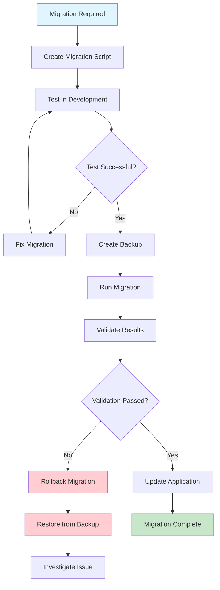
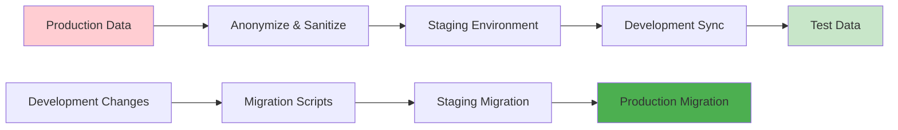

# Data Migration Strategy

This document outlines comprehensive data migration strategies for small-to-medium applications (50-100 users). The focus is on safe, reliable data migrations that maintain data integrity while supporting environment transitions.

**Related Documents:**
- `DEPLOYMENT_STRATEGY.md` - Database migrations integrated into deployment pipeline
- `ENVIRONMENT_SETUP.md` - Environment parity and configuration for data consistency
- `SECURITY_STRATEGY.md` - Data security during migrations and transitions
- `ERROR_RESILIENCE_STRATEGY.md` - Error handling and rollback procedures for failed migrations
- `LOGGING_STRATEGY.md` - Migration logging and audit trails
- `TESTING_STRATEGY.md` - Migration testing and validation procedures
- `TECHNICAL_DESIGN_STRATEGY.md` - Data architecture and migration planning
- `coding_principles.md` - Core principles including environment parity

**Core Principle:** Data migrations should be safe, reversible, and thoroughly tested. Data integrity is paramount - it's better to fail safely than to corrupt data.

## Data Migration Philosophy

### 1. **Safety First**
- **Principle**: Every migration must be safe and reversible
- **Implementation**: Always backup before migrations, test rollback procedures
- **Validation**: Verify data integrity before and after migrations
- **Monitoring**: Track migration progress and detect issues early

### 2. **Environment Consistency**
- **Principle**: Migrations should work identically across all environments
- **Implementation**: Use identical migration tools and procedures
- **Testing**: Test migrations in staging before production
- **Validation**: Ensure data structure consistency across environments

### 3. **Incremental Changes**
- **Principle**: Make small, incremental changes rather than large transformations
- **Implementation**: Break complex migrations into smaller, manageable steps
- **Benefits**: Easier to test, debug, and rollback individual changes
- **Strategy**: Zero-downtime migrations when possible

## Migration Types and Strategies

### Migration Process Flow



### Environment Data Flow



### 1. **Schema Migrations**

**Database Schema Changes:**
```javascript
// Schema migration with Knex.js
exports.up = async function(knex) {
  // Create new table
  await knex.schema.createTable('user_profiles', function(table) {
    table.increments('id').primary();
    table.integer('user_id').unsigned().notNullable();
    table.string('first_name', 100).notNullable();
    table.string('last_name', 100).notNullable();
    table.text('bio').nullable();
    table.string('avatar_url', 500).nullable();
    table.timestamps(true, true);
    
    // Foreign key constraint
    table.foreign('user_id').references('id').inTable('users').onDelete('CASCADE');
    
    // Indexes
    table.index('user_id');
  });
  
  // Add column to existing table
  await knex.schema.alterTable('users', function(table) {
    table.boolean('email_verified').defaultTo(false);
    table.timestamp('email_verified_at').nullable();
  });
};

exports.down = async function(knex) {
  // Rollback in reverse order
  await knex.schema.alterTable('users', function(table) {
    table.dropColumn('email_verified_at');
    table.dropColumn('email_verified');
  });
  
  await knex.schema.dropTable('user_profiles');
};
```

**Zero-Downtime Schema Changes:**
```javascript
// Zero-downtime column addition
exports.up = async function(knex) {
  // Step 1: Add new column as nullable
  await knex.schema.alterTable('orders', function(table) {
    table.decimal('tax_amount', 10, 2).nullable();
  });
  
  // Step 2: Populate new column with calculated values
  await knex.raw(`
    UPDATE orders 
    SET tax_amount = (total_amount * 0.08) 
    WHERE tax_amount IS NULL
  `);
  
  // Step 3: Make column not nullable (in next migration)
  // This allows the application to handle both states
};

// Follow-up migration to enforce constraint
exports.up = async function(knex) {
  await knex.schema.alterTable('orders', function(table) {
    table.decimal('tax_amount', 10, 2).notNullable().alter();
  });
};
```

**AI Implementation Guidelines:**
- Always include rollback procedures in down() functions
- Use transactions for complex schema changes
- Test schema changes in staging environment first
- Document breaking changes and required application updates
- Use zero-downtime strategies for production systems

### 2. **Data Migrations**

**Data Transformation and Cleanup:**
```javascript
// Data migration with validation
exports.up = async function(knex) {
  // Get all records that need migration
  const users = await knex('users').select('id', 'full_name').whereNotNull('full_name');
  
  console.log(`Migrating ${users.length} user records`);
  
  // Process in batches to avoid memory issues
  const batchSize = 100;
  for (let i = 0; i < users.length; i += batchSize) {
    const batch = users.slice(i, i + batchSize);
    
    await knex.transaction(async (trx) => {
      for (const user of batch) {
        const nameParts = user.full_name.split(' ');
        const firstName = nameParts[0] || '';
        const lastName = nameParts.slice(1).join(' ') || '';
        
        // Validate data before update
        if (!firstName) {
          console.warn(`User ${user.id} has no first name, skipping`);
          continue;
        }
        
        await trx('users')
          .where('id', user.id)
          .update({
            first_name: firstName,
            last_name: lastName,
            migrated_at: new Date()
          });
      }
    });
    
    console.log(`Processed batch ${Math.floor(i / batchSize) + 1}/${Math.ceil(users.length / batchSize)}`);
  }
  
  // Verify migration results
  const migratedCount = await knex('users').whereNotNull('migrated_at').count('id as count');
  console.log(`Migration completed: ${migratedCount[0].count} records migrated`);
};

exports.down = async function(knex) {
  // Rollback data changes
  await knex('users')
    .whereNotNull('migrated_at')
    .update({
      first_name: null,
      last_name: null,
      migrated_at: null
    });
};
```

**Data Validation and Integrity Checks:**
```javascript
// Migration with comprehensive validation
exports.up = async function(knex) {
  // Pre-migration validation
  const preValidation = await validateDataIntegrity(knex);
  if (!preValidation.valid) {
    throw new Error(`Pre-migration validation failed: ${preValidation.errors.join(', ')}`);
  }
  
  // Backup critical data
  await knex.raw(`
    CREATE TABLE user_emails_backup AS 
    SELECT * FROM user_emails WHERE created_at >= NOW() - INTERVAL '30 days'
  `);
  
  try {
    // Perform migration
    await knex.transaction(async (trx) => {
      // Normalize email addresses
      await trx.raw(`
        UPDATE user_emails 
        SET email = LOWER(TRIM(email))
        WHERE email != LOWER(TRIM(email))
      `);
      
      // Remove duplicate emails
      await trx.raw(`
        DELETE FROM user_emails 
        WHERE id NOT IN (
          SELECT MIN(id) 
          FROM user_emails 
          GROUP BY user_id, email
        )
      `);
    });
    
    // Post-migration validation
    const postValidation = await validateDataIntegrity(knex);
    if (!postValidation.valid) {
      throw new Error(`Post-migration validation failed: ${postValidation.errors.join(', ')}`);
    }
    
    // Clean up backup if successful
    await knex.raw('DROP TABLE user_emails_backup');
    
  } catch (error) {
    // Restore from backup on failure
    await knex.raw(`
      INSERT INTO user_emails 
      SELECT * FROM user_emails_backup 
      ON CONFLICT (id) DO NOTHING
    `);
    
    throw error;
  }
};

// Data validation function
async function validateDataIntegrity(knex) {
  const errors = [];
  
  // Check for orphaned records
  const orphanedEmails = await knex.raw(`
    SELECT COUNT(*) as count 
    FROM user_emails ue 
    LEFT JOIN users u ON ue.user_id = u.id 
    WHERE u.id IS NULL
  `);
  
  if (orphanedEmails.rows[0].count > 0) {
    errors.push(`Found ${orphanedEmails.rows[0].count} orphaned email records`);
  }
  
  // Check for duplicate emails per user
  const duplicateEmails = await knex.raw(`
    SELECT user_id, email, COUNT(*) as count 
    FROM user_emails 
    GROUP BY user_id, email 
    HAVING COUNT(*) > 1
  `);
  
  if (duplicateEmails.rows.length > 0) {
    errors.push(`Found ${duplicateEmails.rows.length} users with duplicate emails`);
  }
  
  return {
    valid: errors.length === 0,
    errors: errors
  };
}
```

**AI Implementation Guidelines:**
- Always validate data before and after migrations
- Process large datasets in batches to avoid memory issues
- Use transactions for data consistency
- Create backups before destructive operations
- Implement comprehensive error handling and rollback procedures

### 3. **Environment Data Migrations**

**Development to Staging Data Sync:**
```javascript
// Safe data sync between environments
const syncEnvironmentData = async (sourceEnv, targetEnv) => {
  const sourceDb = knex(dbConfigs[sourceEnv]);
  const targetDb = knex(dbConfigs[targetEnv]);
  
  try {
    // Define tables to sync (excluding sensitive data)
    const tablesToSync = [
      'products',
      'categories',
      'settings',
      'feature_flags'
    ];
    
    // Tables that need data sanitization
    const sanitizedTables = {
      users: {
        email: 'test+{id}@example.com',
        password: '$2b$10$defaulthashedpassword',
        phone: null,
        address: null
      }
    };
    
    await targetDb.transaction(async (trx) => {
      for (const table of tablesToSync) {
        console.log(`Syncing table: ${table}`);
        
        // Truncate target table
        await trx.raw(`TRUNCATE TABLE ${table} CASCADE`);
        
        // Copy data from source
        const data = await sourceDb(table).select('*');
        
        if (data.length > 0) {
          await trx(table).insert(data);
        }
        
        console.log(`Synced ${data.length} records for ${table}`);
      }
      
      // Handle sanitized tables
      for (const [table, sanitization] of Object.entries(sanitizedTables)) {
        console.log(`Syncing and sanitizing table: ${table}`);
        
        await trx.raw(`TRUNCATE TABLE ${table} CASCADE`);
        
        const data = await sourceDb(table).select('*');
        const sanitizedData = data.map(record => ({
          ...record,
          ...Object.fromEntries(
            Object.entries(sanitization).map(([field, value]) => [
              field,
              typeof value === 'string' && value.includes('{id}') 
                ? value.replace('{id}', record.id)
                : value
            ])
          )
        }));
        
        if (sanitizedData.length > 0) {
          await trx(table).insert(sanitizedData);
        }
        
        console.log(`Synced and sanitized ${sanitizedData.length} records for ${table}`);
      }
    });
    
    console.log('Environment data sync completed successfully');
    
  } catch (error) {
    console.error('Environment data sync failed:', error);
    throw error;
  } finally {
    await sourceDb.destroy();
    await targetDb.destroy();
  }
};
```

**Production Data Anonymization:**
```javascript
// Anonymize production data for staging
const anonymizeProductionData = async () => {
  const db = knex(dbConfigs.staging);
  
  try {
    await db.transaction(async (trx) => {
      // Anonymize user data
      await trx.raw(`
        UPDATE users SET 
          email = CONCAT('user_', id, '@example.com'),
          first_name = CONCAT('User', id),
          last_name = 'Test',
          phone = NULL,
          address = NULL,
          date_of_birth = NULL,
          social_security_number = NULL
      `);
      
      // Anonymize order data
      await trx.raw(`
        UPDATE orders SET 
          shipping_address = '123 Test St, Test City, TC 12345',
          billing_address = '123 Test St, Test City, TC 12345',
          customer_notes = 'Test order data'
        WHERE shipping_address IS NOT NULL
      `);
      
      // Remove sensitive logs
      await trx.raw(`
        DELETE FROM audit_logs 
        WHERE event_type IN ('login', 'password_change', 'payment_processed')
      `);
    });
    
    console.log('Production data anonymization completed');
    
  } catch (error) {
    console.error('Data anonymization failed:', error);
    throw error;
  }
};
```

**AI Implementation Guidelines:**
- Never sync production data to development environments
- Always anonymize sensitive data when moving between environments
- Use environment-specific configuration for data sync
- Implement data retention policies for non-production environments
- Document data sync procedures and schedules

## Migration Testing and Validation

### 1. **Migration Testing Framework**

**Automated Migration Testing:**
```javascript
// Migration testing utilities
const testMigration = async (migrationName) => {
  const testDb = knex({
    client: 'postgresql',
    connection: {
      host: 'localhost',
      user: 'test',
      password: 'test',
      database: 'test_migrations'
    }
  });
  
  try {
    // Create test database snapshot
    await createTestSnapshot(testDb);
    
    // Run migration
    console.log(`Testing migration: ${migrationName}`);
    await testDb.migrate.up({ name: migrationName });
    
    // Validate migration results
    const validationResults = await validateMigrationResults(testDb, migrationName);
    
    if (!validationResults.valid) {
      throw new Error(`Migration validation failed: ${validationResults.errors.join(', ')}`);
    }
    
    // Test rollback
    console.log(`Testing rollback for: ${migrationName}`);
    await testDb.migrate.down({ name: migrationName });
    
    // Validate rollback results
    const rollbackResults = await validateRollbackResults(testDb, migrationName);
    
    if (!rollbackResults.valid) {
      throw new Error(`Rollback validation failed: ${rollbackResults.errors.join(', ')}`);
    }
    
    console.log(`Migration test passed: ${migrationName}`);
    return { success: true, migration: migrationName };
    
  } catch (error) {
    console.error(`Migration test failed: ${migrationName}`, error);
    return { success: false, migration: migrationName, error: error.message };
  } finally {
    await testDb.destroy();
  }
};

// Validation functions
const validateMigrationResults = async (db, migrationName) => {
  const errors = [];
  
  // Check if tables exist
  const expectedTables = getMigrationExpectedTables(migrationName);
  for (const table of expectedTables) {
    const exists = await db.schema.hasTable(table);
    if (!exists) {
      errors.push(`Expected table ${table} does not exist`);
    }
  }
  
  // Check data integrity
  const integrityCheck = await checkDataIntegrity(db);
  if (!integrityCheck.valid) {
    errors.push(...integrityCheck.errors);
  }
  
  return { valid: errors.length === 0, errors };
};
```

### 2. **Performance Testing**

**Migration Performance Monitoring:**
```javascript
// Performance monitoring for migrations
const monitorMigrationPerformance = async (migrationFn) => {
  const startTime = Date.now();
  const startMemory = process.memoryUsage();
  
  try {
    const result = await migrationFn();
    
    const endTime = Date.now();
    const endMemory = process.memoryUsage();
    
    const performance = {
      duration: endTime - startTime,
      memoryUsage: {
        heapUsed: endMemory.heapUsed - startMemory.heapUsed,
        heapTotal: endMemory.heapTotal - startMemory.heapTotal,
        external: endMemory.external - startMemory.external
      }
    };
    
    // Log performance metrics
    console.log('Migration performance:', performance);
    
    // Alert if migration takes too long
    if (performance.duration > 300000) { // 5 minutes
      console.warn('Migration took longer than expected:', performance.duration);
    }
    
    return { success: true, performance, result };
    
  } catch (error) {
    const endTime = Date.now();
    console.error('Migration failed', {
      duration: endTime - startTime,
      error: error.message
    });
    
    throw error;
  }
};
```

## Migration Deployment Integration

### 1. **CI/CD Integration**

**Migration Pipeline:**
```yaml
# Migration step in CI/CD pipeline
migration:
  stage: deploy
  script:
    - echo "Starting database migration"
    - npm run migrate:status
    - npm run migrate:validate
    - npm run migrate:backup
    - npm run migrate:up
    - npm run migrate:verify
  only:
    - main
  environment:
    name: production
  when: manual
  allow_failure: false
```

**Migration Scripts:**
```javascript
// package.json scripts for migration management
{
  "scripts": {
    "migrate:status": "knex migrate:status",
    "migrate:validate": "node scripts/validate-migrations.js",
    "migrate:backup": "node scripts/backup-database.js",
    "migrate:up": "knex migrate:latest",
    "migrate:down": "knex migrate:rollback",
    "migrate:verify": "node scripts/verify-migration.js",
    "migrate:test": "node scripts/test-migrations.js"
  }
}
```

### 2. **Rollback Procedures**

**Automated Rollback:**
```javascript
// Automated rollback on migration failure
const safelyRunMigration = async () => {
  const db = knex(dbConfig);
  
  try {
    // Create backup before migration
    const backupName = `backup_${Date.now()}`;
    await createDatabaseBackup(backupName);
    
    // Get current migration state
    const currentMigrations = await db.migrate.currentVersion();
    
    // Run migrations
    const [batchNo, migrations] = await db.migrate.latest();
    
    // Verify migration success
    const verification = await verifyMigrationSuccess(db);
    
    if (!verification.valid) {
      throw new Error(`Migration verification failed: ${verification.errors.join(', ')}`);
    }
    
    console.log('Migration completed successfully');
    
    // Clean up old backups
    await cleanupOldBackups();
    
  } catch (error) {
    console.error('Migration failed, initiating rollback:', error);
    
    try {
      // Attempt database rollback
      await db.migrate.rollback();
      
      // Verify rollback success
      const rollbackVerification = await verifyRollbackSuccess(db);
      
      if (!rollbackVerification.valid) {
        // Restore from backup as last resort
        await restoreFromBackup(backupName);
      }
      
      console.log('Rollback completed successfully');
      
    } catch (rollbackError) {
      console.error('Rollback failed:', rollbackError);
      
      // Alert operations team
      await sendCriticalAlert({
        type: 'MIGRATION_ROLLBACK_FAILED',
        message: 'Database migration and rollback both failed',
        originalError: error.message,
        rollbackError: rollbackError.message
      });
      
      throw rollbackError;
    }
    
    throw error;
  }
};
```

## Migration Best Practices for AI Implementation

### 1. **Safe Migration Practices**

**AI Must Follow:**
- Always create backups before migrations
- Test migrations in staging environment first
- Use transactions for data consistency
- Implement comprehensive validation
- Plan and test rollback procedures

### 2. **Migration Documentation**

**AI Must Document:**
- Migration purpose and expected changes
- Data transformation logic and validation
- Rollback procedures and requirements
- Performance impact and expected duration
- Dependencies and prerequisites

### 3. **Error Handling and Monitoring**

**AI Must Implement:**
- Comprehensive error handling for all migration steps
- Progress monitoring and logging
- Performance monitoring and alerting
- Automated rollback on critical failures
- Post-migration validation and verification

## Migration Implementation Checklist

### Pre-Migration Planning
- [ ] Migration requirements clearly defined
- [ ] Data backup strategy implemented
- [ ] Migration tested in staging environment
- [ ] Rollback procedures planned and tested
- [ ] Performance impact assessed
- [ ] Dependencies and prerequisites identified

### Migration Implementation
- [ ] Migration scripts with proper error handling
- [ ] Data validation before and after migration
- [ ] Transaction management for data consistency
- [ ] Progress monitoring and logging
- [ ] Automated rollback procedures
- [ ] Performance monitoring and alerting

### Post-Migration Validation
- [ ] Data integrity verification completed
- [ ] Application functionality tested
- [ ] Performance metrics within expected ranges
- [ ] Rollback procedures verified
- [ ] Migration documentation updated
- [ ] Team training on new data structure

**AI Responsibility**: Ensure all migration procedures are thoroughly tested, documented, and include comprehensive error handling and rollback capabilities before considering migration strategy complete. 