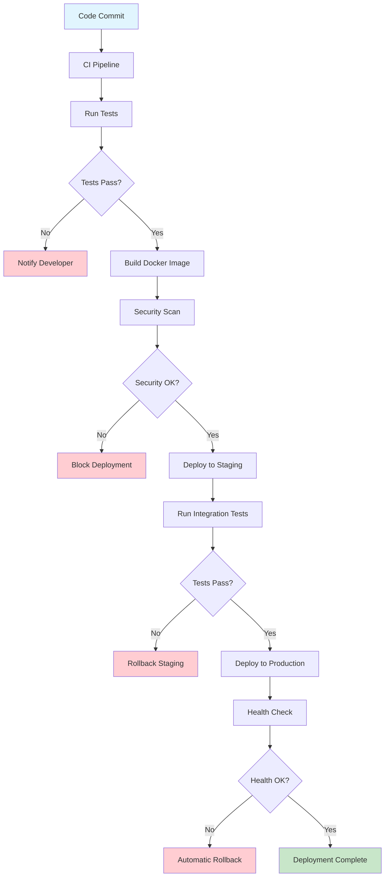
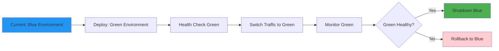

# Deployment Strategy

This document outlines practical deployment strategies for small-to-medium applications (50-100 users). The focus is on simple, reliable deployment processes that maintain environment parity without over-engineering.

**Related Documents:**
- `ENVIRONMENT_SETUP.md` - Environment parity principles and configuration management
- `SECURITY_STRATEGY.md` - Secure deployment practices and infrastructure security
- `ERROR_RESILIENCE_STRATEGY.md` - Error handling and monitoring in production
- `LOGGING_STRATEGY.md` - Production logging and observability
- `MONITORING_STRATEGY.md` - Production monitoring and alerting
- `DATA_MIGRATION_STRATEGY.md` - Database deployments and migrations
- `coding_principles.md` - Core principles including environment parity
- `TECHNICAL_DESIGN_STRATEGY.md` - Deployment architecture decisions

**Core Principle:** Deployment should be simple, predictable, and boring. The goal is to make deployment a non-event that happens frequently without stress.

## Deployment Philosophy

### 1. **Environment Parity**
- **Principle**: Development, staging, and production environments should be as similar as possible
- **Implementation**: Use containerization and infrastructure as code
- **Benefit**: Reduces deployment surprises and "works on my machine" problems
- **Tools**: Docker, Docker Compose, external secret management

### 2. **Automated Deployment**
- **Principle**: Manual deployment steps should be eliminated
- **Implementation**: CI/CD pipelines with automated testing and deployment
- **Benefit**: Reduces human error and enables frequent deployments
- **Scope**: Appropriate automation for small teams without over-engineering

### 3. **Rollback Capability**
- **Principle**: Every deployment should be easily reversible
- **Implementation**: Blue-green deployments, database migration rollbacks
- **Benefit**: Reduces risk and enables quick recovery from issues
- **Simplicity**: Simple rollback procedures that work under pressure

## Deployment Architecture

### 1. **Containerized Applications**

**Container Strategy:**
```dockerfile
# Multi-stage Dockerfile for production optimization
FROM node:18-alpine AS builder
WORKDIR /app
COPY package*.json ./
RUN npm ci --only=production

FROM node:18-alpine AS runtime
WORKDIR /app

# Create non-root user for security
RUN addgroup -g 1001 -S nodejs
RUN adduser -S nextjs -u 1001

# Copy application files
COPY --from=builder /app/node_modules ./node_modules
COPY --chown=nextjs:nodejs . .

# Switch to non-root user
USER nextjs

# Expose port and start application
EXPOSE 3000
CMD ["npm", "start"]
```

**Docker Compose for Development:**
```yaml
version: '3.8'
services:
  app:
    build: .
    ports:
      - "3000:3000"
    environment:
      - NODE_ENV=development
      - DATABASE_URL=postgresql://user:pass@db:5432/appdb
    depends_on:
      - db
    volumes:
      - .:/app
      - /app/node_modules
    
  db:
    image: postgres:15-alpine
    environment:
      POSTGRES_DB: appdb
      POSTGRES_USER: user
      POSTGRES_PASSWORD: pass
    ports:
      - "5432:5432"
    volumes:
      - postgres_data:/var/lib/postgresql/data

volumes:
  postgres_data:
```

**AI Implementation Guidelines:**
- Use multi-stage builds to optimize image size
- Run containers as non-root users for security
- Use Alpine Linux base images for minimal attack surface
- Implement health checks for container orchestration
- Use .dockerignore to exclude unnecessary files

### 2. **Environment Configuration**

**External Secret Management:**
```javascript
// Configuration loading with external secrets
const loadConfig = () => {
  const config = {
    // Public configuration
    port: process.env.PORT || 3000,
    nodeEnv: process.env.NODE_ENV || 'development',
    
    // Database configuration
    database: {
      host: process.env.DB_HOST,
      port: process.env.DB_PORT || 5432,
      name: process.env.DB_NAME,
      user: process.env.DB_USER,
      password: process.env.DB_PASSWORD, // From external secret store
      ssl: process.env.DB_SSL === 'true'
    },
    
    // External API configuration
    externalApis: {
      paymentService: {
        url: process.env.PAYMENT_API_URL,
        apiKey: process.env.PAYMENT_API_KEY // From external secret store
      }
    },
    
    // Security configuration
    security: {
      jwtSecret: process.env.JWT_SECRET, // From external secret store
      sessionSecret: process.env.SESSION_SECRET, // From external secret store
      encryptionKey: process.env.ENCRYPTION_KEY // From external secret store
    }
  };
  
  // Validate required configuration
  const requiredVars = [
    'DB_HOST', 'DB_NAME', 'DB_USER', 'DB_PASSWORD',
    'JWT_SECRET', 'SESSION_SECRET'
  ];
  
  const missing = requiredVars.filter(varName => !process.env[varName]);
  if (missing.length > 0) {
    throw new Error(`Missing required environment variables: ${missing.join(', ')}`);
  }
  
  return config;
};
```

**Environment-Specific Configuration:**
```yaml
# docker-compose.production.yml
version: '3.8'
services:
  app:
    image: myapp:${VERSION}
    restart: unless-stopped
    environment:
      - NODE_ENV=production
      - DATABASE_URL=${DATABASE_URL}
      - JWT_SECRET=${JWT_SECRET}
      - SESSION_SECRET=${SESSION_SECRET}
    healthcheck:
      test: ["CMD", "curl", "-f", "http://localhost:3000/health"]
      interval: 30s
      timeout: 10s
      retries: 3
    depends_on:
      - db
    
  db:
    image: postgres:15-alpine
    restart: unless-stopped
    environment:
      POSTGRES_DB: ${DB_NAME}
      POSTGRES_USER: ${DB_USER}
      POSTGRES_PASSWORD: ${DB_PASSWORD}
    volumes:
      - postgres_data:/var/lib/postgresql/data
    healthcheck:
      test: ["CMD-SHELL", "pg_isready -U ${DB_USER}"]
      interval: 10s
      timeout: 5s
      retries: 5

volumes:
  postgres_data:
```

**AI Implementation Guidelines:**
- Use external secret management (Doppler, AWS Secrets Manager, etc.)
- Validate all required environment variables at startup
- Use different configuration files for different environments
- Implement configuration validation and error handling
- Document all environment variables and their purposes

## CI/CD Pipeline

### 1. **Simple CI/CD with GitHub Actions**

**Basic Pipeline:**
```yaml
# .github/workflows/deploy.yml
name: Deploy Application

on:
  push:
    branches: [main]
  pull_request:
    branches: [main]

jobs:
  test:
    runs-on: ubuntu-latest
    steps:
      - uses: actions/checkout@v3
      
      - name: Setup Node.js
        uses: actions/setup-node@v3
        with:
          node-version: '18'
          cache: 'npm'
          
      - name: Install dependencies
        run: npm ci
        
      - name: Run tests
        run: npm test
        
      - name: Run security audit
        run: npm audit --audit-level moderate
        
      - name: Run linting
        run: npm run lint

  build:
    needs: test
    runs-on: ubuntu-latest
    if: github.ref == 'refs/heads/main'
    steps:
      - uses: actions/checkout@v3
      
      - name: Build Docker image
        run: |
          docker build -t myapp:${{ github.sha }} .
          docker tag myapp:${{ github.sha }} myapp:latest
          
      - name: Run security scan
        run: |
          docker run --rm -v /var/run/docker.sock:/var/run/docker.sock \
            aquasec/trivy image myapp:${{ github.sha }}
            
      - name: Push to registry
        run: |
          echo ${{ secrets.DOCKER_PASSWORD }} | docker login -u ${{ secrets.DOCKER_USERNAME }} --password-stdin
          docker push myapp:${{ github.sha }}
          docker push myapp:latest

  deploy:
    needs: build
    runs-on: ubuntu-latest
    if: github.ref == 'refs/heads/main'
    steps:
      - uses: actions/checkout@v3
      
      - name: Deploy to production
        run: |
          # Simple deployment script
          ssh ${{ secrets.DEPLOY_USER }}@${{ secrets.DEPLOY_HOST }} << 'EOF'
            cd /opt/myapp
            docker-compose pull
            docker-compose up -d
            docker system prune -f
          EOF
```

**AI Implementation Guidelines:**
- Run all tests before deployment
- Include security scanning in the pipeline
- Use secrets management for sensitive data
- Implement automatic rollback on deployment failure
- Keep deployment scripts simple and idempotent

### 2. **Database Migration Strategy**

**Migration Pipeline Integration:**
```javascript
// Database migration with rollback capability
const runMigrations = async () => {
  const knex = require('knex')(dbConfig);
  
  try {
    // Check current migration status
    const currentVersion = await knex.migrate.currentVersion();
    logger.info('Current database version', { version: currentVersion });
    
    // Run pending migrations
    const [batchNo, migrations] = await knex.migrate.latest();
    
    if (migrations.length > 0) {
      logger.info('Migrations completed', {
        batchNo: batchNo,
        migrations: migrations
      });
    } else {
      logger.info('No pending migrations');
    }
    
    return { success: true, migrations };
    
  } catch (error) {
    logger.error('Migration failed', {
      error: error.message,
      stack: error.stack
    });
    
    // Attempt rollback
    try {
      await knex.migrate.rollback();
      logger.info('Migration rolled back successfully');
    } catch (rollbackError) {
      logger.error('Rollback failed', {
        error: rollbackError.message,
        stack: rollbackError.stack
      });
    }
    
    throw error;
  } finally {
    await knex.destroy();
  }
};

// Pre-deployment migration check
const validateMigrations = async () => {
  const knex = require('knex')(dbConfig);
  
  try {
    // Check if migrations can be run safely
    const pendingMigrations = await knex.migrate.list();
    
    if (pendingMigrations[1].length > 0) {
      logger.info('Pending migrations detected', {
        count: pendingMigrations[1].length,
        migrations: pendingMigrations[1]
      });
    }
    
    return pendingMigrations[1].length;
    
  } catch (error) {
    logger.error('Migration validation failed', {
      error: error.message
    });
    throw error;
  } finally {
    await knex.destroy();
  }
};
```

**AI Implementation Guidelines:**
- Always backup database before migrations
- Test migrations in staging environment first
- Implement rollback procedures for failed migrations
- Use database migration tools (Knex, Sequelize, etc.)
- Log all migration activities with correlation IDs

## Deployment Environments

### Deployment Pipeline Flow



### Blue-Green Deployment



### 1. **Environment Structure**

**Three-Environment Setup:**
```
Development Environment:
- Local development with Docker Compose
- Hot reloading and debugging enabled
- Test data and relaxed security
- Detailed error messages and logging

Staging Environment:
- Production-like environment for testing
- Production data structure with test data
- Production security settings
- Full integration testing

Production Environment:
- Live user environment
- Real data and strict security
- Monitoring and alerting enabled
- Minimal logging of sensitive information
```

**Environment Configuration:**
```javascript
// Environment-specific configuration
const environments = {
  development: {
    database: {
      host: 'localhost',
      port: 5432,
      ssl: false,
      logging: true
    },
    logging: {
      level: 'debug',
      prettyPrint: true
    },
    security: {
      strictMode: false,
      corsOrigin: '*'
    }
  },
  
  staging: {
    database: {
      host: process.env.DB_HOST,
      port: process.env.DB_PORT,
      ssl: true,
      logging: false
    },
    logging: {
      level: 'info',
      prettyPrint: false
    },
    security: {
      strictMode: true,
      corsOrigin: process.env.CORS_ORIGIN
    }
  },
  
  production: {
    database: {
      host: process.env.DB_HOST,
      port: process.env.DB_PORT,
      ssl: true,
      logging: false
    },
    logging: {
      level: 'warn',
      prettyPrint: false
    },
    security: {
      strictMode: true,
      corsOrigin: process.env.CORS_ORIGIN
    }
  }
};
```

### 2. **Blue-Green Deployment**

**Simple Blue-Green Setup:**
```bash
#!/bin/bash
# Simple blue-green deployment script

CURRENT_COLOR=$(docker-compose ps | grep "myapp" | grep "Up" | wc -l > 0 && echo "blue" || echo "green")
NEW_COLOR=$([ "$CURRENT_COLOR" = "blue" ] && echo "green" || echo "blue")

echo "Current deployment: $CURRENT_COLOR"
echo "Deploying to: $NEW_COLOR"

# Start new version
docker-compose -f docker-compose.$NEW_COLOR.yml up -d

# Health check
echo "Waiting for health check..."
for i in {1..30}; do
  if curl -f http://localhost:${NEW_COLOR_PORT}/health; then
    echo "Health check passed"
    break
  fi
  sleep 10
done

# Switch traffic (update load balancer or proxy)
echo "Switching traffic to $NEW_COLOR"
# Update nginx configuration or load balancer

# Stop old version
docker-compose -f docker-compose.$CURRENT_COLOR.yml down

echo "Deployment completed: $NEW_COLOR"
```

**AI Implementation Guidelines:**
- Implement health checks for deployment validation
- Use load balancers or reverse proxies for traffic switching
- Keep both versions running during transition
- Implement automatic rollback on health check failure
- Monitor deployment metrics and error rates

## Monitoring and Alerting

### 1. **Deployment Monitoring**

**Deployment Health Checks:**
```javascript
// Health check endpoint
app.get('/health', async (req, res) => {
  const health = {
    status: 'healthy',
    timestamp: new Date().toISOString(),
    version: process.env.APP_VERSION,
    environment: process.env.NODE_ENV,
    checks: {}
  };
  
  try {
    // Database health check
    const dbStart = Date.now();
    await db.raw('SELECT 1');
    health.checks.database = {
      status: 'healthy',
      responseTime: Date.now() - dbStart
    };
    
    // External API health check
    const apiStart = Date.now();
    await axios.get(process.env.EXTERNAL_API_URL + '/health', { timeout: 5000 });
    health.checks.externalApi = {
      status: 'healthy',
      responseTime: Date.now() - apiStart
    };
    
    res.status(200).json(health);
    
  } catch (error) {
    health.status = 'unhealthy';
    health.error = error.message;
    
    logger.error('Health check failed', {
      error: error.message,
      health: health
    });
    
    res.status(503).json(health);
  }
});

// Readiness check endpoint
app.get('/ready', async (req, res) => {
  try {
    // Check if application is ready to serve traffic
    await db.raw('SELECT 1');
    
    res.status(200).json({
      status: 'ready',
      timestamp: new Date().toISOString()
    });
    
  } catch (error) {
    res.status(503).json({
      status: 'not ready',
      error: error.message,
      timestamp: new Date().toISOString()
    });
  }
});
```

### 2. **Deployment Alerts**

**Alert Configuration:**
```javascript
// Deployment alert configuration
const DEPLOYMENT_ALERTS = {
  // Deployment failure
  DEPLOYMENT_FAILED: {
    condition: 'deployment_status == "failed"',
    severity: 'CRITICAL',
    channels: ['email', 'slack'],
    message: 'Deployment failed - immediate attention required'
  },
  
  // Health check failure
  HEALTH_CHECK_FAILED: {
    condition: 'health_check_failures > 3',
    duration: '5m',
    severity: 'CRITICAL',
    channels: ['email', 'slack'],
    message: 'Application health checks failing'
  },
  
  // High error rate after deployment
  POST_DEPLOYMENT_ERRORS: {
    condition: 'error_rate > 5% AND deployment_time < 30m',
    severity: 'WARNING',
    channels: ['email', 'slack'],
    message: 'High error rate detected after deployment'
  }
};
```

## Deployment Best Practices for AI Implementation

### 1. **Deployment Automation**

**AI Must Implement:**
- Automated testing before deployment
- Automated database migrations
- Automated security scanning
- Automated rollback procedures
- Automated monitoring and alerting

### 2. **Environment Consistency**

**AI Must Ensure:**
- Identical configuration across environments
- Containerized applications for consistency
- External secret management
- Environment-specific configuration validation
- Proper logging and monitoring in all environments

### 3. **Deployment Safety**

**AI Must Include:**
- Health checks and readiness probes
- Blue-green or rolling deployment strategies
- Database backup before migrations
- Rollback procedures and testing
- Post-deployment monitoring and validation

## Deployment Implementation Checklist

### Pre-Deployment Setup
- [ ] Containerized application with multi-stage builds
- [ ] External secret management configured
- [ ] Environment-specific configuration files created
- [ ] Database migration scripts and rollback procedures
- [ ] CI/CD pipeline with automated testing
- [ ] Health check and readiness endpoints implemented

### Deployment Pipeline
- [ ] Automated testing in CI/CD pipeline
- [ ] Security scanning integrated
- [ ] Database migration automation
- [ ] Blue-green or rolling deployment strategy
- [ ] Automated rollback procedures
- [ ] Post-deployment health checks
- [ ] Monitoring and alerting configured

### Post-Deployment Validation
- [ ] Application health checks passing
- [ ] Database migrations completed successfully
- [ ] Security configurations validated
- [ ] Monitoring and alerting working
- [ ] Rollback procedures tested
- [ ] Documentation updated with deployment procedures

**AI Responsibility**: Ensure all deployment procedures are automated, tested, and documented before considering deployment strategy complete. 