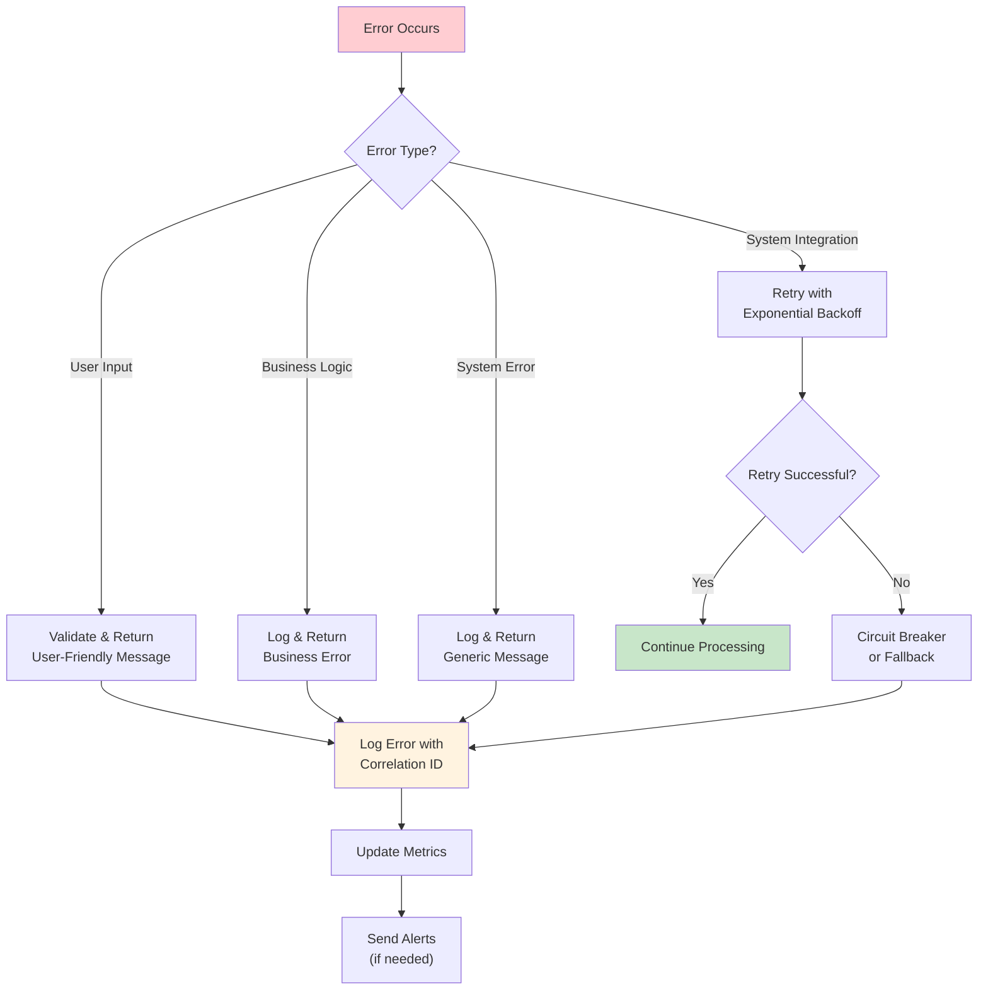
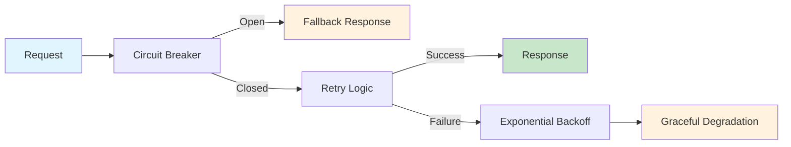

# Error Handling & Resilience Strategy

This document outlines comprehensive error handling and resilience patterns for small-to-medium applications (50-100 users). The focus is on practical, simple error handling that provides good user experience while maintaining system stability.

**Related Documents:**
- `LOGGING_STRATEGY.md` - **Tightly integrated** - All errors must be logged with proper correlation
- `SECURITY_STRATEGY.md` - Security-aware error handling without information disclosure
- `FUNCTIONAL_DESIGN_STRATEGY.md` - Error scenarios must be identified during functional design
- `TECHNICAL_DESIGN_STRATEGY.md` - Error handling architecture decisions
- `TESTING_STRATEGY.md` - Error scenarios must be tested comprehensively
- `MONITORING_STRATEGY.md` - Error monitoring and alerting integration
- `coding_principles.md` - Error handling as part of core development principles

**Core Principle:** Errors are inevitable - plan for them, handle them gracefully, log them comprehensively, and learn from them. Simple, consistent error handling is better than complex, inconsistent approaches.

## Error Handling Philosophy

### 1. **Fail Fast, Recover Gracefully**
- **Principle**: Detect errors early, handle them appropriately, and provide meaningful feedback
- **Implementation**: Validate inputs early, use defensive programming, implement proper fallbacks
- **User Experience**: Users should never see technical error details but should understand what went wrong
- **System Stability**: Errors in one component shouldn't cascade to bring down the entire system

### 2. **Comprehensive Error Logging**
- **Principle**: Every error must be logged with sufficient context for debugging
- **Integration**: Tight integration with `LOGGING_STRATEGY.md` for structured error logging
- **Correlation**: Use correlation IDs to trace errors across system components
- **Security**: Log errors without exposing sensitive information to users

### 3. **Predictable Error Responses**
- **Principle**: Consistent error response format across all application layers
- **Implementation**: Standardized error objects, HTTP status codes, and user messages
- **Documentation**: Clear error codes and messages for API consumers
- **Monitoring**: Structured error data for monitoring and alerting

## Error Categories and Handling Strategies

### Error Handling Flow



### Resilience Patterns



### 1. **User Input Errors**

**Characteristics:**
- Invalid data format, missing required fields, business rule violations
- Predictable and preventable through validation
- User can typically correct the error

**Handling Strategy:**
```javascript
// Input Validation Error Handling
const validateUserInput = (data) => {
  const errors = [];
  
  // Validate required fields
  if (!data.email) {
    errors.push({
      field: 'email',
      code: 'REQUIRED',
      message: 'Email address is required'
    });
  }
  
  // Validate format
  if (data.email && !isValidEmail(data.email)) {
    errors.push({
      field: 'email',
      code: 'INVALID_FORMAT',
      message: 'Please enter a valid email address'
    });
  }
  
  return errors;
};

// API Error Response
const handleValidationError = (req, res, errors) => {
  // Log validation error with correlation ID
  logger.warn('Input validation failed', {
    correlationId: req.correlationId,
    userId: req.user?.id,
    endpoint: req.path,
    errors: errors,
    userAgent: req.headers['user-agent']
  });
  
  // Return user-friendly error response
  res.status(400).json({
    error: 'VALIDATION_ERROR',
    message: 'Please correct the following errors',
    details: errors,
    correlationId: req.correlationId
  });
};
```

**AI Implementation Guidelines:**
- Always validate input at the application boundary
- Provide specific, actionable error messages
- Log validation errors with full context
- Use consistent error response format
- Don't expose internal validation logic to users

### 2. **System Integration Errors**

**Characteristics:**
- Database connection failures, external API failures, network timeouts
- Often transient and may succeed on retry
- System-level issues that users can't directly fix

**Handling Strategy:**
```javascript
// Database Connection Error Handling
const executeWithRetry = async (operation, maxRetries = 3, delay = 1000) => {
  for (let attempt = 1; attempt <= maxRetries; attempt++) {
    try {
      return await operation();
    } catch (error) {
      // Log each retry attempt
      logger.warn('Operation failed, retrying', {
        correlationId: req.correlationId,
        attempt: attempt,
        maxRetries: maxRetries,
        error: error.message,
        errorCode: error.code
      });
      
      // Don't retry on certain error types
      if (isNonRetryableError(error)) {
        throw error;
      }
      
      // Wait before retry (exponential backoff)
      if (attempt < maxRetries) {
        await new Promise(resolve => setTimeout(resolve, delay * attempt));
      } else {
        throw error;
      }
    }
  }
};

// External API Error Handling
const callExternalAPI = async (url, data) => {
  try {
    const response = await axios.post(url, data, {
      timeout: 5000,
      retry: 3
    });
    return response.data;
  } catch (error) {
    // Log external API error
    logger.error('External API call failed', {
      correlationId: req.correlationId,
      url: url,
      statusCode: error.response?.status,
      errorMessage: error.message,
      responseData: error.response?.data
    });
    
    // Provide fallback or graceful degradation
    if (error.response?.status === 503) {
      // Service unavailable - use cached data or fallback
      return await getFallbackData();
    }
    
    throw new SystemError('External service unavailable', 'EXTERNAL_API_ERROR');
  }
};
```

**AI Implementation Guidelines:**
- Implement retry logic with exponential backoff
- Use circuit breaker pattern for external dependencies
- Provide fallback mechanisms where possible
- Log all integration errors with full context
- Implement timeout handling for all external calls

### 3. **Business Logic Errors**

**Characteristics:**
- Violations of business rules, state conflicts, authorization failures
- Application-specific errors that require business context
- May require user action or administrative intervention

**Handling Strategy:**
```javascript
// Business Rule Validation
class BusinessRuleError extends Error {
  constructor(message, code, details = {}) {
    super(message);
    this.name = 'BusinessRuleError';
    this.code = code;
    this.details = details;
  }
}

// Example: Order Processing
const processOrder = async (orderData, user) => {
  try {
    // Check business rules
    if (orderData.amount > user.creditLimit) {
      throw new BusinessRuleError(
        'Order amount exceeds credit limit',
        'CREDIT_LIMIT_EXCEEDED',
        { 
          orderAmount: orderData.amount,
          creditLimit: user.creditLimit,
          userId: user.id
        }
      );
    }
    
    // Process order...
    return await createOrder(orderData);
    
  } catch (error) {
    if (error instanceof BusinessRuleError) {
      // Log business rule violation
      logger.warn('Business rule violation', {
        correlationId: req.correlationId,
        userId: user.id,
        ruleCode: error.code,
        ruleMessage: error.message,
        ruleDetails: error.details
      });
      
      // Return business-friendly error
      return {
        success: false,
        error: error.code,
        message: error.message,
        canRetry: false
      };
    }
    
    // Re-throw system errors
    throw error;
  }
};
```

**AI Implementation Guidelines:**
- Create specific error classes for business rule violations
- Provide clear, business-friendly error messages
- Log business rule violations with business context
- Indicate whether the error is retryable
- Don't expose internal business logic in error messages

### 4. **System Errors**

**Characteristics:**
- Unexpected errors, programming bugs, resource exhaustion
- Usually indicate system problems that require investigation
- Users can't fix these errors directly

**Handling Strategy:**
```javascript
// Global Error Handler
const globalErrorHandler = (error, req, res, next) => {
  // Generate correlation ID if not present
  const correlationId = req.correlationId || generateCorrelationId();
  
  // Log all system errors
  logger.error('Unhandled system error', {
    correlationId: correlationId,
    userId: req.user?.id,
    endpoint: req.path,
    method: req.method,
    userAgent: req.headers['user-agent'],
    error: {
      name: error.name,
      message: error.message,
      stack: error.stack
    }
  });
  
  // Return generic error response
  res.status(500).json({
    error: 'SYSTEM_ERROR',
    message: 'An unexpected error occurred. Please try again later.',
    correlationId: correlationId,
    // Only include details in development
    details: process.env.NODE_ENV === 'development' ? error.message : undefined
  });
};

// Graceful Shutdown Handler
const gracefulShutdown = () => {
  logger.info('Graceful shutdown initiated');
  
  // Close database connections
  database.close();
  
  // Close HTTP server
  server.close(() => {
    logger.info('HTTP server closed');
    process.exit(0);
  });
  
  // Force shutdown after timeout
  setTimeout(() => {
    logger.error('Forced shutdown after timeout');
    process.exit(1);
  }, 10000);
};

process.on('SIGTERM', gracefulShutdown);
process.on('SIGINT', gracefulShutdown);
```

**AI Implementation Guidelines:**
- Implement global error handlers for unhandled errors
- Log all system errors with full context and stack traces
- Provide generic error messages to users
- Implement graceful shutdown procedures
- Use process monitoring and automatic restart capabilities

## Error Response Standards

### 1. **Consistent Error Response Format**

```javascript
// Standard Error Response Structure
const ErrorResponse = {
  error: 'ERROR_CODE',           // Machine-readable error code
  message: 'User-friendly message', // Human-readable message
  correlationId: 'uuid',         // For tracking and support
  timestamp: '2024-01-01T00:00:00Z', // When error occurred
  details: {                     // Optional additional context
    field: 'email',
    code: 'INVALID_FORMAT'
  },
  canRetry: false,              // Whether user should retry
  supportContact: 'support@example.com' // How to get help
};

// HTTP Status Code Mapping
const ERROR_STATUS_CODES = {
  // Client Errors (4xx)
  'VALIDATION_ERROR': 400,
  'AUTHENTICATION_REQUIRED': 401,
  'AUTHORIZATION_FAILED': 403,
  'RESOURCE_NOT_FOUND': 404,
  'BUSINESS_RULE_VIOLATION': 422,
  'RATE_LIMIT_EXCEEDED': 429,
  
  // Server Errors (5xx)
  'SYSTEM_ERROR': 500,
  'DATABASE_ERROR': 503,
  'EXTERNAL_API_ERROR': 503,
  'TIMEOUT_ERROR': 504
};
```

### 2. **Error Code Taxonomy**

```javascript
// Error Code Structure: CATEGORY_SPECIFIC_REASON
const ERROR_CODES = {
  // Input Validation Errors
  'VALIDATION_REQUIRED': 'Field is required',
  'VALIDATION_FORMAT': 'Invalid format',
  'VALIDATION_LENGTH': 'Invalid length',
  'VALIDATION_RANGE': 'Value out of range',
  
  // Authentication Errors
  'AUTH_INVALID_CREDENTIALS': 'Invalid username or password',
  'AUTH_ACCOUNT_LOCKED': 'Account temporarily locked',
  'AUTH_SESSION_EXPIRED': 'Session has expired',
  'AUTH_TOKEN_INVALID': 'Invalid authentication token',
  
  // Authorization Errors
  'AUTHZ_INSUFFICIENT_PERMISSIONS': 'Insufficient permissions',
  'AUTHZ_RESOURCE_ACCESS_DENIED': 'Access to resource denied',
  'AUTHZ_OPERATION_NOT_ALLOWED': 'Operation not allowed',
  
  // Business Rule Errors
  'BUSINESS_CREDIT_LIMIT_EXCEEDED': 'Credit limit exceeded',
  'BUSINESS_INVENTORY_INSUFFICIENT': 'Insufficient inventory',
  'BUSINESS_DUPLICATE_ENTRY': 'Duplicate entry not allowed',
  
  // System Errors
  'SYSTEM_DATABASE_UNAVAILABLE': 'Database temporarily unavailable',
  'SYSTEM_EXTERNAL_API_UNAVAILABLE': 'External service unavailable',
  'SYSTEM_TIMEOUT': 'Request timeout',
  'SYSTEM_INTERNAL_ERROR': 'Internal system error'
};
```

## Resilience Patterns

### 1. **Circuit Breaker Pattern**

```javascript
// Simple Circuit Breaker Implementation
class CircuitBreaker {
  constructor(threshold = 5, timeout = 60000) {
    this.threshold = threshold;
    this.timeout = timeout;
    this.failureCount = 0;
    this.lastFailureTime = null;
    this.state = 'CLOSED'; // CLOSED, OPEN, HALF_OPEN
  }
  
  async call(operation, fallback = null) {
    if (this.state === 'OPEN') {
      if (Date.now() - this.lastFailureTime > this.timeout) {
        this.state = 'HALF_OPEN';
      } else {
        logger.warn('Circuit breaker is OPEN, using fallback', {
          correlationId: req.correlationId,
          failureCount: this.failureCount,
          lastFailureTime: this.lastFailureTime
        });
        return fallback ? await fallback() : null;
      }
    }
    
    try {
      const result = await operation();
      this.onSuccess();
      return result;
    } catch (error) {
      this.onFailure();
      throw error;
    }
  }
  
  onSuccess() {
    this.failureCount = 0;
    this.state = 'CLOSED';
  }
  
  onFailure() {
    this.failureCount++;
    this.lastFailureTime = Date.now();
    
    if (this.failureCount >= this.threshold) {
      this.state = 'OPEN';
      logger.error('Circuit breaker opened', {
        correlationId: req.correlationId,
        failureCount: this.failureCount,
        threshold: this.threshold
      });
    }
  }
}
```

### 2. **Retry with Exponential Backoff**

```javascript
// Retry Strategy with Exponential Backoff
const retryWithBackoff = async (
  operation,
  maxRetries = 3,
  baseDelay = 1000,
  maxDelay = 30000
) => {
  for (let attempt = 1; attempt <= maxRetries; attempt++) {
    try {
      return await operation();
    } catch (error) {
      if (attempt === maxRetries || !isRetryableError(error)) {
        throw error;
      }
      
      // Calculate delay with exponential backoff and jitter
      const delay = Math.min(
        baseDelay * Math.pow(2, attempt - 1) + Math.random() * 1000,
        maxDelay
      );
      
      logger.warn('Operation failed, retrying with backoff', {
        correlationId: req.correlationId,
        attempt: attempt,
        maxRetries: maxRetries,
        delay: delay,
        error: error.message
      });
      
      await new Promise(resolve => setTimeout(resolve, delay));
    }
  }
};

// Determine if error is retryable
const isRetryableError = (error) => {
  // Don't retry client errors (4xx) except for specific cases
  if (error.response?.status >= 400 && error.response?.status < 500) {
    return ['408', '429'].includes(error.response.status.toString());
  }
  
  // Retry server errors (5xx) and network errors
  return error.response?.status >= 500 || error.code === 'ECONNRESET';
};
```

### 3. **Graceful Degradation**

```javascript
// Graceful Degradation Strategy
const getUserRecommendations = async (userId) => {
  try {
    // Try primary recommendation service
    return await recommendationService.getRecommendations(userId);
  } catch (error) {
    logger.warn('Primary recommendation service failed, using fallback', {
      correlationId: req.correlationId,
      userId: userId,
      error: error.message
    });
    
    try {
      // Fallback to cached recommendations
      return await getCachedRecommendations(userId);
    } catch (cacheError) {
      logger.warn('Cached recommendations failed, using default', {
        correlationId: req.correlationId,
        userId: userId,
        error: cacheError.message
      });
      
      // Final fallback to default recommendations
      return getDefaultRecommendations();
    }
  }
};
```

## Error Monitoring and Alerting

### 1. **Error Metrics and Monitoring**

```javascript
// Error Metrics Collection
const errorMetrics = {
  // Track error rates by type
  incrementErrorCount: (errorType, endpoint) => {
    metrics.increment('errors.total', {
      type: errorType,
      endpoint: endpoint
    });
  },
  
  // Track error response times
  recordErrorResponseTime: (duration, errorType) => {
    metrics.histogram('errors.response_time', duration, {
      type: errorType
    });
  },
  
  // Track error recovery success
  recordRecoveryAttempt: (success, strategy) => {
    metrics.increment('errors.recovery_attempts', {
      success: success,
      strategy: strategy
    });
  }
};

// Error Rate Monitoring
const monitorErrorRates = () => {
  setInterval(() => {
    const errorRate = calculateErrorRate();
    
    if (errorRate > ERROR_RATE_THRESHOLD) {
      logger.error('High error rate detected', {
        errorRate: errorRate,
        threshold: ERROR_RATE_THRESHOLD,
        timestamp: new Date().toISOString()
      });
      
      // Send alert to monitoring system
      alertingService.sendAlert({
        type: 'HIGH_ERROR_RATE',
        severity: 'WARNING',
        message: `Error rate ${errorRate}% exceeds threshold ${ERROR_RATE_THRESHOLD}%`,
        metadata: { errorRate, threshold: ERROR_RATE_THRESHOLD }
      });
    }
  }, 60000); // Check every minute
};
```

### 2. **Alert Configuration**

```javascript
// Alert Rules Configuration
const ALERT_RULES = {
  // High error rate
  HIGH_ERROR_RATE: {
    condition: 'error_rate > 5%',
    duration: '5m',
    severity: 'WARNING',
    channels: ['email', 'slack']
  },
  
  // Critical system errors
  CRITICAL_SYSTEM_ERROR: {
    condition: 'system_errors > 0',
    duration: '1m',
    severity: 'CRITICAL',
    channels: ['email', 'slack', 'pagerduty']
  },
  
  // Database connection failures
  DATABASE_CONNECTION_FAILURE: {
    condition: 'database_errors > 3',
    duration: '2m',
    severity: 'CRITICAL',
    channels: ['email', 'slack']
  },
  
  // External API failures
  EXTERNAL_API_FAILURE: {
    condition: 'external_api_errors > 10',
    duration: '5m',
    severity: 'WARNING',
    channels: ['email']
  }
};
```

## Error Handling Best Practices for AI Implementation

### 1. **Comprehensive Error Handling**

**AI Must Implement:**
- Try-catch blocks around all async operations
- Proper error propagation through application layers
- Specific error handling for different error types
- Consistent error response formatting
- Comprehensive error logging with correlation IDs

### 2. **Error Recovery Strategies**

**AI Must Consider:**
- Retry logic for transient failures
- Circuit breaker patterns for external dependencies
- Fallback mechanisms for degraded functionality
- Graceful degradation when services are unavailable
- User-friendly error messages and recovery suggestions

### 3. **Error Documentation**

**AI Must Document:**
- All possible error scenarios and their handling
- Error codes and their meanings
- Recovery procedures and fallback strategies
- Monitoring and alerting configurations
- Error response formats and examples

## Error Handling Implementation Checklist

### Pre-Implementation Error Planning
- [ ] Error scenarios identified during functional design
- [ ] Error handling architecture defined during technical design
- [ ] Error response formats standardized
- [ ] Error logging strategy integrated with logging framework
- [ ] Error monitoring and alerting strategy defined

### Implementation Error Handling
- [ ] Input validation with proper error responses
- [ ] Business rule validation with appropriate error codes
- [ ] System error handling with global error handlers
- [ ] Retry logic implemented for transient failures
- [ ] Circuit breaker patterns implemented for external dependencies
- [ ] Graceful degradation strategies implemented
- [ ] Error logging with correlation IDs and structured data
- [ ] Error monitoring and metrics collection implemented

### Post-Implementation Error Validation
- [ ] Error handling tested for all identified scenarios
- [ ] Error responses validated for consistency and security
- [ ] Error logging validated for completeness and correlation
- [ ] Error monitoring and alerting tested
- [ ] Error recovery procedures documented and tested
- [ ] Error handling documentation complete and accurate

**AI Responsibility**: Ensure comprehensive error handling is implemented for all identified error scenarios before considering implementation complete. 