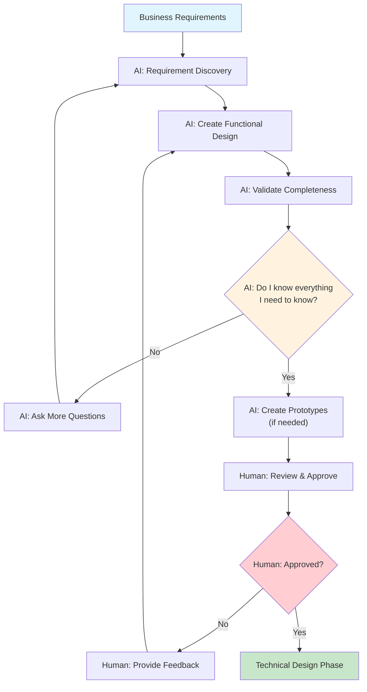

# Functional Design Strategy

This document outlines the critical process of creating functional designs that serve as the foundation for all AI-assisted development work. The functional design is the bridge between business requirements and technical implementation.

**Related Documents:**
- `coding_principles.md` - "You are the Architect" principle - functional design is core architectural work
- `TECHNICAL_DESIGN_STRATEGY.md` - **Next step** - Technical implementation planning
- `ENVIRONMENT_SETUP.md` - Environment must support the functional requirements
- `TESTING_STRATEGY.md` - Tests validate that implementation meets functional design
- `LOGGING_STRATEGY.md` - Logging requirements emerge from functional design
- `PROJECT_TEMPLATES.md` - Functional design templates and documentation structure

**Critical Rule:** No code implementation begins until the functional design is complete and approved. **The AI must actively ensure it has everything needed before proceeding.**

## Purpose of Functional Design

### 1. **Primary Objectives**
- **Bridge Business and Technical**: Translate business requirements into detailed functional specifications
- **AI Guidance**: Provide comprehensive context for AI-assisted implementation
- **Validation Framework**: Create criteria for evaluating whether implementation meets requirements
- **Communication Tool**: Ensure all stakeholders understand what will be built
- **Completeness Assurance**: Ensure AI has all information needed before technical implementation

### 2. **AI-Specific Benefits**
- **Rich Context**: Gives AI detailed understanding of what needs to be built and why
- **Decision Framework**: Provides criteria for AI to make implementation choices
- **Validation Reference**: Enables AI to self-check implementation against requirements
- **Scope Boundaries**: Clearly defines what is and isn't included in the implementation
- **Assumption Elimination**: Prevents AI from making assumptions during implementation

### 3. **Human-AI Collaboration**
- **Human Role**: Provide business context, domain expertise, and final approval
- **AI Role**: **Actively elicit requirements, create functional design, ensure completeness**
- **Shared Validation**: Both human and AI validate functional design before proceeding
- **AI Responsibility**: Ensure no information gaps exist before technical implementation

## Functional Design Process

### Process Overview



### Phase 1: Requirement Discovery (Human-AI Collaboration)

**Human Role**: Provide business context, stakeholder access, and domain expertise
**AI Role**: **Actively elicit comprehensive requirements through systematic questioning**

**1. Business Context Analysis**
- **AI Questions to Ask**:
  - "What specific business problem are we solving?"
  - "Who are the stakeholders and what are their different needs?"
  - "What does success look like from a business perspective?"
  - "What are the constraints, regulations, or compliance requirements?"
  - "What happens if we don't solve this problem?"
  - "Are there existing solutions and why aren't they adequate?"

**2. User Journey Mapping**
- **AI Questions to Ask**:
  - "Who are the different types of users and what are their roles?"
  - "Can you walk me through how users currently handle this task?"
  - "What are the pain points in the current process?"
  - "What would the ideal user experience look like?"
  - "Are there different workflows for different user types?"
  - "What are the edge cases where the normal workflow breaks down?"

**3. Functional Requirements Gathering**
- **AI Questions to Ask**:
  - "What are the core features that must be included?"
  - "Can you give me specific examples of how each feature would be used?"
  - "What data needs to be captured, processed, or displayed?"
  - "How does this system need to integrate with existing systems?"
  - "What are the error scenarios and how should they be handled?"
  - "Are there seasonal, time-based, or volume-based variations in usage?"

### Phase 2: Functional Design Creation (AI-Led with Human Validation)

**AI Role**: **Create comprehensive functional design by synthesizing requirements**
**Human Role**: Validate, refine, and approve the functional design

**AI Responsibility**: Before proceeding to technical design, the AI must be able to answer "YES" to the critical question: **"Do I know everything I need to know to design this system?"**

**1. System Overview Creation**
- **AI Creates**:
  - Clear purpose statement based on discovered requirements
  - Explicit scope definition (what's included and what's not)
  - Measurable success metrics
  - Documented assumptions and their implications
- **AI Validation Questions**:
  - "Is the purpose clear and unambiguous?"
  - "Are the scope boundaries well-defined?"
  - "Can success be measured objectively?"
  - "Are all assumptions documented and validated?"

**2. Feature Specifications**
- **AI Creates**:
  - Comprehensive feature list with detailed descriptions
  - User interaction flows for each feature
  - Business rules and logic governing feature behavior
  - Data requirements for each feature
- **AI Validation Questions**:
  - "Are all user scenarios covered?"
  - "Are the business rules complete and unambiguous?"
  - "Do I understand how each feature contributes to the business goals?"
  - "Are there any gaps in the feature specifications?"

**3. Data and Information Architecture**
- **AI Creates**:
  - Complete data models and relationships
  - Data flow diagrams showing information movement
  - Data validation rules and constraints
  - Data security and privacy requirements
- **AI Validation Questions**:
  - "Is all required data identified and defined?"
  - "Are data relationships clear and complete?"
  - "Are data validation rules comprehensive?"
  - "Are security and privacy requirements addressed?"

**4. Interface and Integration Design**
- **AI Creates**:
  - User interface requirements and mockups
  - API specifications for external integrations
  - Integration points with existing systems
  - Communication protocols and data formats
- **AI Validation Questions**:
  - "Are the user interface requirements clear enough for implementation?"
  - "Are all integration points identified and specified?"
  - "Do I understand how data flows between systems?"
  - "Should we create UI prototypes to validate understanding?"

### Phase 3: Validation and Completeness Check (AI-Driven)

**AI Role**: **Ensure functional design is complete before proceeding to technical design**
**Human Role**: Final approval and sign-off

**1. Completeness Validation**
- **AI Must Verify**:
  - All user scenarios are covered
  - All business rules are documented
  - All data requirements are specified
  - All integration points are defined
  - All error scenarios are addressed
- **AI Questions for Self-Assessment**:
  - "Can I implement this system based on this functional design?"
  - "Are there any ambiguities that could lead to implementation errors?"
  - "Do I understand the business value of each feature?"
  - "Are there any missing pieces that would require assumptions during implementation?"

**2. Prototype and Validation**
- **AI Should Propose**:
  - UI mockups or prototypes to validate understanding
  - Data flow diagrams to confirm system behavior
  - User journey walkthroughs to verify completeness
  - Business rule examples to test logic
- **AI Questions**:
  - "Should we create a UI prototype to validate the user experience?"
  - "Would a data flow diagram help confirm our understanding?"
  - "Should we walk through specific user scenarios to test completeness?"
  - "Are there any complex business rules that need examples?"

**3. Final Approval**
- **AI Presents**:
  - Complete functional design document
  - Identified assumptions and risks
  - Proposed validation approaches (prototypes, walkthroughs)
  - Explicit confirmation of readiness for technical design
- **AI Declaration Required**:
  - "I have all the information needed to design and implement this system"
  - "The functional design is complete and unambiguous"
  - "I understand the business value and user needs"
  - "I am ready to proceed to technical design"

## Functional Design Document Structure

### 1. Executive Summary
```
- Project Overview: Brief description of what is being built
- Business Justification: Why this project is important
- Success Criteria: How success will be measured
- Key Stakeholders: Who is involved and their roles
```

### 2. Business Context
```
- Problem Statement: What problem are we solving?
- Current State: How things work today
- Desired Future State: How things should work
- Business Value: What value will this create?
```

### 3. User Analysis
```
- User Types: Different categories of users
- User Personas: Detailed user profiles
- User Journeys: How users will interact with the system
- User Needs: What users need to accomplish
```

### 4. Functional Requirements
```
- Core Features: Essential functionality
- Feature Details: Detailed specifications for each feature
- User Stories: Requirements from user perspective
- Acceptance Criteria: How to validate each requirement
```

### 5. System Behavior
```
- Business Rules: Logic governing system behavior
- Workflows: Step-by-step processes
- Data Processing: How information is handled
- Error Handling: What happens when things go wrong
```

### 6. Data Architecture
```
- Data Models: Structure of information
- Data Flows: How information moves
- Data Validation: Rules for data quality
- Data Security: How information is protected
```

### 7. Interface Design
```
- User Interface Requirements: What users will see
- API Specifications: How systems will communicate
- Integration Points: Connections to other systems
- Communication Protocols: Technical communication methods
```

### 8. Non-Functional Requirements
```
- Performance Requirements: Speed and efficiency needs
- Security Requirements: Protection and compliance needs
- Scalability Requirements: Growth and volume needs
- Availability Requirements: Uptime and reliability needs
```

### 9. Constraints and Assumptions
```
- Technical Constraints: Technology limitations
- Business Constraints: Budget, time, resource limitations
- Regulatory Constraints: Legal and compliance requirements
- Key Assumptions: Important assumptions being made
```

### 10. Success Metrics and Validation
```
- Key Performance Indicators: Measurable success criteria
- Testing Approach: How functionality will be validated
- Acceptance Criteria: What defines "done"
- Success Metrics: How to measure project success
```

## AI Implementation Guidance

### 1. **Active Requirement Elicitation**

**AI Responsibility**: Do not passively wait for requirements. Actively ask questions to ensure complete understanding.

**Before Starting Functional Design:**
- **Ask Probing Questions**: Use systematic questioning to uncover all requirements
- **Identify Gaps**: Actively look for missing information or unclear requirements
- **Validate Understanding**: Confirm understanding through examples and scenarios
- **Challenge Assumptions**: Question assumptions to ensure they are valid

**During Functional Design Creation:**
- **Synthesize Information**: Combine all gathered information into comprehensive specifications
- **Identify Conflicts**: Look for contradictions or conflicts in requirements
- **Fill Gaps**: Identify missing pieces and ask specific questions to fill them
- **Validate Completeness**: Continuously assess whether enough information exists

**Critical Checkpoint**: Before proceeding to technical design, the AI must explicitly confirm:
- "I have all the information needed to design and implement this system"
- "There are no ambiguities that would require assumptions during implementation"
- "I understand the business value and user needs for every feature"

### 2. **Completeness Validation Process**

**AI Must Ask Itself**:
- Can I implement every feature based on the functional design?
- Do I understand the business rules well enough to code them?
- Are there any user scenarios I'm unsure about?
- Would I need to make assumptions during implementation?
- Are there any integration points I don't fully understand?

**If Any Answer is "NO" or "MAYBE"**:
- **Stop the process** - do not proceed to technical design
- **Identify specific gaps** in understanding
- **Ask targeted questions** to fill those gaps
- **Propose prototypes or mockups** to validate understanding
- **Request walkthroughs** of complex scenarios

**Validation Techniques**:
- **Create UI Mockups**: "Should we create a mockup to validate the user interface?"
- **Data Flow Diagrams**: "Let me create a diagram to confirm how data flows through the system"
- **User Journey Walkthroughs**: "Can we walk through how a user would complete this task?"
- **Business Rule Examples**: "Let me give you examples of how this business rule would work"

### 3. **Prototyping and Validation**

**When to Propose Prototyping**:
- User interface requirements are complex or unclear
- User workflows involve multiple steps or decision points
- Business rules have complex logic or many conditions
- Integration points have unclear data formats or protocols
- Error handling scenarios are complex or numerous

**Types of Prototypes to Suggest**:
- **UI Wireframes**: For user interface validation
- **Data Flow Diagrams**: For system behavior validation
- **User Journey Maps**: For workflow validation
- **Business Rule Decision Trees**: For logic validation
- **API Mock-ups**: For integration validation

**Prototype Validation Questions**:
- "Does this mockup accurately represent what users should see?"
- "Does this workflow cover all the scenarios we discussed?"
- "Are these business rules complete and correct?"
- "Does this data flow match your expectations?"

### 4. **AI Questions to Ask During Implementation**

**Requirement Validation (Updated)**:
- Does this implementation fulfill the functional requirement exactly as specified?
- Are all acceptance criteria met without any assumptions?
- Does this align with the business rules I documented?
- Are edge cases handled as specified in the functional design?
- **If I'm unsure about any of these, should I ask for clarification?**

**Design Alignment (Updated)**:
- Does this technical approach support the functional design perfectly?
- Are data flows implemented exactly as specified?
- Do interfaces match the functional design requirements?
- Are integration points implemented as documented?
- **If there are any gaps, should I stop and ask questions?**

**Completeness Check (New)**:
- Am I implementing based on complete functional requirements?
- Are there any parts where I'm making assumptions?
- Do I fully understand the business value of what I'm building?
- **If I don't have complete information, I must ask for it before proceeding**

### 5. **When to Stop and Ask Questions**

**Immediate Stop Triggers**:
- Any requirement is ambiguous or unclear
- Business rules have gaps or contradictions
- User workflows are incomplete or confusing
- Data requirements are missing or undefined
- Integration specifications are vague or incomplete
- Error handling is not fully specified

**Question Patterns to Use**:
- "I need to understand [specific area] better before I can implement it correctly"
- "Can you walk me through how [specific scenario] should work?"
- "What should happen when [specific condition] occurs?"
- "I want to make sure I understand [specific requirement] - can you give me an example?"
- "Should we create a mockup to validate my understanding of [specific feature]?"

**Escalation Protocol**:
- **Stop implementation immediately** when gaps are identified
- **Document specific questions** that need answers
- **Propose validation approaches** (prototypes, walkthroughs, examples)
- **Do not proceed** until all questions are answered and validated

## Best Practices for Functional Design

### 1. **Clarity and Precision**
- Use clear, unambiguous language
- Define all terms and concepts
- Provide specific examples and scenarios
- Avoid technical jargon in functional descriptions

### 2. **Completeness**
- Cover all functional requirements thoroughly
- Include edge cases and error scenarios
- Specify all data requirements and relationships
- Define all user interactions and workflows

### 3. **Traceability**
- Link requirements to business needs
- Connect features to user stories
- Trace acceptance criteria to requirements
- Map implementation to functional design

### 4. **Maintainability**
- Keep functional design up to date
- Document changes and rationale
- Version control functional design documents
- Review and update regularly

### 5. **Validation**
- Include testable acceptance criteria
- Define measurable success metrics
- Specify validation approaches
- Plan for user acceptance testing

## Integration with Development Workflow

### 1. **Project Initiation**
- Functional design is the first deliverable
- No technical design begins until functional design is complete
- Functional design drives all subsequent technical decisions
- Stakeholder approval required before proceeding to technical design

### 2. **Technical Design Process**
- Functional design serves as the foundation for technical design *(See `TECHNICAL_DESIGN_STRATEGY.md`)*
- AI uses functional design to make all technical decisions
- Technical design must address every functional requirement
- Changes to functional design require technical design updates

### 3. **Development Process**
- AI references both functional and technical designs for implementation
- Regular validation against functional design requirements
- Changes to functional design require human approval and technical design updates
- Implementation gaps trigger functional design review

### 4. **Testing and Validation**
- Tests validate implementation against functional design *(See `TESTING_STRATEGY.md`)*
- Acceptance criteria from functional design become test cases
- User acceptance testing validates functional design assumptions
- Success metrics from functional design guide validation

### 5. **Deployment and Maintenance**
- Functional design guides deployment decisions
- Monitoring and logging requirements emerge from functional design
- Future enhancements reference original functional design
- Functional design evolves with business needs

## Templates and Tools

### 1. **Functional Design Template**
- Standardized document structure
- Required sections and content
- Approval checkpoints and sign-offs
- Version control and change management

### 2. **Requirement Gathering Tools**
- User story templates
- Acceptance criteria formats
- Business rule documentation
- Data model templates

### 3. **Validation Tools**
- Requirement traceability matrices
- Acceptance criteria checklists
- Validation test plans
- Success metric dashboards

This functional design strategy ensures that AI-assisted development is grounded in clear business requirements and user needs, providing the context necessary for effective implementation while maintaining human oversight of strategic decisions. 