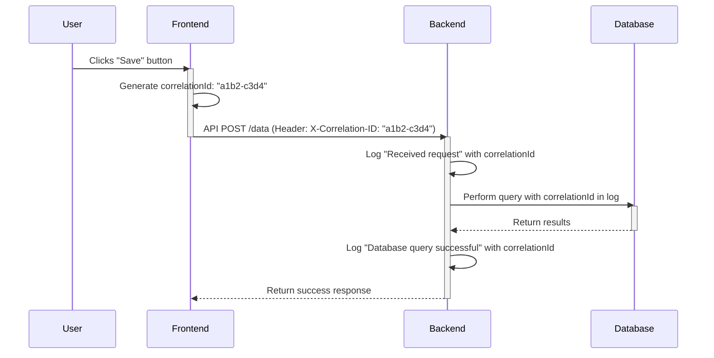

# Logging and Observability Strategy

This document outlines our strategy for logging across all services (frontend, backend, etc.). The primary goal is to create a system where logs are structured, correlated, and centralized, enabling effective and AI-assisted debugging.

**Related Documents:**
- `coding_principles.md` - "Context is the Fuel" principle - logs provide debugging context
- `TESTING_STRATEGY.md` - **Critical integration** - Test result logging and correlation
- `ENVIRONMENT_SETUP.md` - Docker logging configuration and environment parity
- `MCP_STRATEGY.md` - AI tools can analyze structured logs for debugging
- `PROJECT_TEMPLATES.md` - Logging configuration templates

**AI Integration:** Structured logs enable AI assistants to effectively analyze and debug issues across distributed systems.

## 1. Structured Logging

All log output **must** be in a structured, machine-readable format, specifically JSON. This allows for reliable parsing, filtering, and analysis by both humans and AI tools.

### Example

**Avoid unstructured logs like this:**
```
"Error: User 456 failed to update their profile."
```

**Instead, use structured logs like this:**
```json
{
  "timestamp": "2023-10-27T11:30:05Z",
  "level": "error",
  "message": "User profile update failed",
  "service": "backend-user-service",
  "correlationId": "a1b2c3d4-e5f6-7890-1234-567890abcdef",
  "details": {
    "userId": 456,
    "requestPath": "/api/users/456",
    "reason": "Database connection timeout"
  }
}
```

## 2. Correlation via Correlation ID

To trace a single logical operation across multiple services (e.g., a user action in the frontend that triggers a backend API call), we will use a **Correlation ID**.

### Workflow

1.  **Generation:** The `correlationId` is generated by the first service that receives the user request (typically the frontend).
2.  **Propagation:** This ID is included in every log message related to that request within the service.
3.  **Transmission:** The ID is passed to downstream services in the header of API calls (e.g., as `X-Correlation-ID`).
4.  **Adoption:** Downstream services extract this ID and include it in all their logs for that request.

### Sequence Diagram



## 3. Log Centralization

To enable analysis, all logs must be collected in a central location.

*   **Local Development:** All services should write their structured JSON logs to a single, shared file (e.g., `development.log`) in the project root.
*   **Staging/Production:** Logs will be shipped to a dedicated log aggregation service (e.g., Datadog, Splunk, ELK Stack).

## 4. AI-Assisted Debugging Workflow

With this infrastructure in place, our debugging process becomes highly efficient:

1.  **Isolate:** An error occurs. Find the `correlationId` from any related log message or network request.
2.  **Aggregate:** Collect all log entries for that `correlationId`. A simple local command would be `grep "<correlationId>" development.log`.
3.  **Analyze:** Provide the aggregated logs to the AI assistant. Because the logs are structured and correlated, the AI can trace the entire flow of the request and provide a precise analysis of the root cause. 