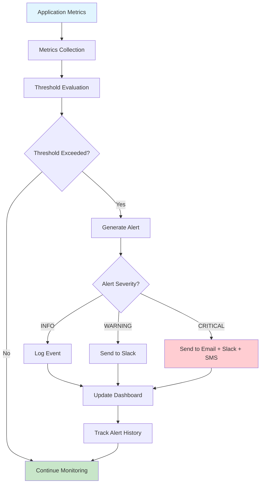
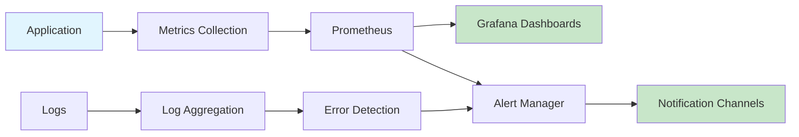

# Monitoring Strategy

This document outlines practical monitoring and observability strategies for small-to-medium applications (50-100 users). The focus is on simple, effective monitoring that provides actionable insights without overwhelming small teams.

**Related Documents:**
- `LOGGING_STRATEGY.md` - **Tightly integrated** - Monitoring builds on structured logging foundation
- `ERROR_RESILIENCE_STRATEGY.md` - Error monitoring and incident response integration
- `DEPLOYMENT_STRATEGY.md` - Deployment monitoring and health checks
- `SECURITY_STRATEGY.md` - Security monitoring and threat detection
- `PERFORMANCE_STRATEGY.md` - Performance monitoring and optimization
- `coding_principles.md` - Monitoring as part of core development practices

**Core Principle:** Monitor what matters, alert on what's actionable, and keep it simple. Good monitoring helps you understand your system and respond to issues quickly.

## Monitoring Philosophy

### 1. **Monitor What Matters**
- **Principle**: Focus on metrics that directly impact user experience and business outcomes
- **Implementation**: Track key performance indicators (KPIs) and service level indicators (SLIs)
- **Avoid**: Vanity metrics that don't lead to actionable insights
- **Focus**: User-facing metrics, system health, and business metrics

### 2. **Alert on Actionable Issues**
- **Principle**: Every alert should require immediate action or investigation
- **Implementation**: Clear escalation paths, meaningful alert messages, proper severity levels
- **Avoid**: Alert fatigue from too many false positives or non-actionable alerts
- **Goal**: Maintain high signal-to-noise ratio in alerting

### 3. **Simple and Sustainable**
- **Principle**: Monitoring should be easy to maintain and understand
- **Implementation**: Use managed services where possible, avoid complex custom solutions
- **Team Size**: Appropriate for small teams without dedicated operations staff
- **Maintenance**: Minimal ongoing maintenance and configuration

## Monitoring Architecture

### 1. **Three-Layer Monitoring Stack**

**Application Layer Monitoring:**
```javascript
// Application metrics collection
const express = require('express');
const prometheus = require('prom-client');

// Create custom metrics
const httpRequestDuration = new prometheus.Histogram({
  name: 'http_request_duration_seconds',
  help: 'Duration of HTTP requests in seconds',
  labelNames: ['method', 'route', 'status_code']
});

const httpRequestsTotal = new prometheus.Counter({
  name: 'http_requests_total',
  help: 'Total number of HTTP requests',
  labelNames: ['method', 'route', 'status_code']
});

const activeUsers = new prometheus.Gauge({
  name: 'active_users_current',
  help: 'Current number of active users'
});

const businessMetrics = new prometheus.Gauge({
  name: 'business_orders_total',
  help: 'Total number of orders processed',
  labelNames: ['status']
});

// Middleware to collect HTTP metrics
const metricsMiddleware = (req, res, next) => {
  const start = Date.now();
  
  res.on('finish', () => {
    const duration = (Date.now() - start) / 1000;
    const route = req.route ? req.route.path : req.path;
    
    httpRequestDuration
      .labels(req.method, route, res.statusCode.toString())
      .observe(duration);
    
    httpRequestsTotal
      .labels(req.method, route, res.statusCode.toString())
      .inc();
  });
  
  next();
};

// Business metrics collection
const updateBusinessMetrics = async () => {
  try {
    // Update order metrics
    const orderCounts = await getOrderCounts();
    businessMetrics.labels('completed').set(orderCounts.completed);
    businessMetrics.labels('pending').set(orderCounts.pending);
    businessMetrics.labels('cancelled').set(orderCounts.cancelled);
    
    // Update user metrics
    const activeUserCount = await getActiveUserCount();
    activeUsers.set(activeUserCount);
    
  } catch (error) {
    console.error('Failed to update business metrics:', error);
  }
};

// Update business metrics every minute
setInterval(updateBusinessMetrics, 60000);
```

**Infrastructure Layer Monitoring:**
```yaml
# docker-compose.yml with monitoring stack
version: '3.8'
services:
  app:
    build: .
    ports:
      - "3000:3000"
    environment:
      - NODE_ENV=production
    labels:
      - "prometheus.io/scrape=true"
      - "prometheus.io/port=3000"
      - "prometheus.io/path=/metrics"
    
  prometheus:
    image: prom/prometheus:latest
    ports:
      - "9090:9090"
    volumes:
      - ./prometheus.yml:/etc/prometheus/prometheus.yml
      - prometheus_data:/prometheus
    command:
      - '--config.file=/etc/prometheus/prometheus.yml'
      - '--storage.tsdb.path=/prometheus'
      - '--web.console.libraries=/etc/prometheus/console_libraries'
      - '--web.console.templates=/etc/prometheus/consoles'
      - '--storage.tsdb.retention.time=200h'
      - '--web.enable-lifecycle'
    
  grafana:
    image: grafana/grafana:latest
    ports:
      - "3001:3000"
    environment:
      - GF_SECURITY_ADMIN_PASSWORD=admin
    volumes:
      - grafana_data:/var/lib/grafana
      - ./grafana/dashboards:/etc/grafana/provisioning/dashboards
      - ./grafana/datasources:/etc/grafana/provisioning/datasources

volumes:
  prometheus_data:
  grafana_data:
```

**External Service Monitoring:**
```javascript
// External service health monitoring
const monitorExternalServices = async () => {
  const services = [
    {
      name: 'payment_api',
      url: process.env.PAYMENT_API_URL + '/health',
      timeout: 5000
    },
    {
      name: 'email_service',
      url: process.env.EMAIL_SERVICE_URL + '/health',
      timeout: 3000
    },
    {
      name: 'database',
      check: async () => {
        const result = await db.raw('SELECT 1');
        return result.rows.length > 0;
      }
    }
  ];
  
  for (const service of services) {
    try {
      let isHealthy = false;
      const startTime = Date.now();
      
      if (service.url) {
        const response = await axios.get(service.url, {
          timeout: service.timeout
        });
        isHealthy = response.status === 200;
      } else if (service.check) {
        isHealthy = await service.check();
      }
      
      const responseTime = Date.now() - startTime;
      
      // Record service health metrics
      serviceHealthGauge.labels(service.name).set(isHealthy ? 1 : 0);
      serviceResponseTime.labels(service.name).observe(responseTime / 1000);
      
      if (!isHealthy) {
        logger.warn('External service unhealthy', {
          service: service.name,
          responseTime: responseTime
        });
      }
      
    } catch (error) {
      serviceHealthGauge.labels(service.name).set(0);
      
      logger.error('External service check failed', {
        service: service.name,
        error: error.message
      });
    }
  }
};

// Check external services every 30 seconds
setInterval(monitorExternalServices, 30000);
```

## Key Metrics and KPIs

### 1. **Application Performance Metrics**

**Response Time and Throughput:**
```javascript
// Key performance indicators
const performanceMetrics = {
  // Response time percentiles
  responseTimeP50: new prometheus.Histogram({
    name: 'http_request_duration_p50',
    help: '50th percentile response time',
    buckets: [0.1, 0.5, 1, 2, 5, 10]
  }),
  
  responseTimeP95: new prometheus.Histogram({
    name: 'http_request_duration_p95',
    help: '95th percentile response time',
    buckets: [0.1, 0.5, 1, 2, 5, 10]
  }),
  
  // Throughput metrics
  requestsPerSecond: new prometheus.Gauge({
    name: 'http_requests_per_second',
    help: 'HTTP requests per second'
  }),
  
  // Error rate
  errorRate: new prometheus.Gauge({
    name: 'http_error_rate',
    help: 'HTTP error rate percentage'
  }),
  
  // Database performance
  dbQueryDuration: new prometheus.Histogram({
    name: 'db_query_duration_seconds',
    help: 'Database query duration',
    labelNames: ['query_type']
  })
};

// Calculate and update performance metrics
const updatePerformanceMetrics = () => {
  const now = Date.now();
  const timeWindow = 60000; // 1 minute
  
  // Calculate requests per second
  const recentRequests = getRecentRequests(timeWindow);
  const rps = recentRequests.length / (timeWindow / 1000);
  performanceMetrics.requestsPerSecond.set(rps);
  
  // Calculate error rate
  const errorRequests = recentRequests.filter(r => r.statusCode >= 400);
  const errorRate = (errorRequests.length / recentRequests.length) * 100;
  performanceMetrics.errorRate.set(errorRate || 0);
};
```

### 2. **Business Metrics**

**User and Business KPIs:**
```javascript
// Business metrics collection
const businessMetrics = {
  // User engagement
  dailyActiveUsers: new prometheus.Gauge({
    name: 'daily_active_users',
    help: 'Number of daily active users'
  }),
  
  // Business operations
  ordersCreated: new prometheus.Counter({
    name: 'orders_created_total',
    help: 'Total orders created',
    labelNames: ['status']
  }),
  
  revenue: new prometheus.Gauge({
    name: 'revenue_total',
    help: 'Total revenue',
    labelNames: ['period']
  }),
  
  // Feature usage
  featureUsage: new prometheus.Counter({
    name: 'feature_usage_total',
    help: 'Feature usage count',
    labelNames: ['feature_name']
  })
};

// Update business metrics
const updateBusinessMetrics = async () => {
  try {
    // Daily active users
    const dau = await getDailyActiveUsers();
    businessMetrics.dailyActiveUsers.set(dau);
    
    // Revenue metrics
    const dailyRevenue = await getDailyRevenue();
    businessMetrics.revenue.labels('daily').set(dailyRevenue);
    
    const monthlyRevenue = await getMonthlyRevenue();
    businessMetrics.revenue.labels('monthly').set(monthlyRevenue);
    
    // Order metrics
    const orderStats = await getOrderStatistics();
    businessMetrics.ordersCreated.labels('completed').inc(orderStats.completed);
    businessMetrics.ordersCreated.labels('pending').inc(orderStats.pending);
    
  } catch (error) {
    logger.error('Failed to update business metrics', { error: error.message });
  }
};
```

### 3. **System Health Metrics**

**Infrastructure and Resource Monitoring:**
```javascript
// System health metrics
const systemMetrics = {
  // Memory usage
  memoryUsage: new prometheus.Gauge({
    name: 'nodejs_memory_usage_bytes',
    help: 'Node.js memory usage',
    labelNames: ['type']
  }),
  
  // CPU usage
  cpuUsage: new prometheus.Gauge({
    name: 'nodejs_cpu_usage_percent',
    help: 'Node.js CPU usage percentage'
  }),
  
  // Database connections
  dbConnections: new prometheus.Gauge({
    name: 'database_connections_active',
    help: 'Active database connections'
  }),
  
  // Event loop lag
  eventLoopLag: new prometheus.Gauge({
    name: 'nodejs_eventloop_lag_seconds',
    help: 'Event loop lag in seconds'
  })
};

// Collect system metrics
const collectSystemMetrics = () => {
  // Memory metrics
  const memUsage = process.memoryUsage();
  systemMetrics.memoryUsage.labels('rss').set(memUsage.rss);
  systemMetrics.memoryUsage.labels('heapUsed').set(memUsage.heapUsed);
  systemMetrics.memoryUsage.labels('heapTotal').set(memUsage.heapTotal);
  
  // CPU metrics
  const cpuUsage = process.cpuUsage();
  const cpuPercent = (cpuUsage.user + cpuUsage.system) / 1000000; // Convert to seconds
  systemMetrics.cpuUsage.set(cpuPercent);
  
  // Database connection metrics
  const dbConnCount = db.client.pool.numUsed();
  systemMetrics.dbConnections.set(dbConnCount);
};

// Collect system metrics every 15 seconds
setInterval(collectSystemMetrics, 15000);
```

## Alerting Strategy

### Monitoring and Alerting Flow



### Monitoring Architecture



### 1. **Alert Severity Levels**

**Alert Classification:**
```javascript
// Alert severity levels and thresholds
const ALERT_THRESHOLDS = {
  CRITICAL: {
    // System is down or severely degraded
    errorRate: 25,           // >25% error rate
    responseTime: 10,        // >10 seconds response time
    availability: 95,        // <95% availability
    dbConnections: 90        // >90% database connections used
  },
  
  WARNING: {
    // System is degraded but functional
    errorRate: 10,           // >10% error rate
    responseTime: 5,         // >5 seconds response time
    availability: 98,        // <98% availability
    dbConnections: 75        // >75% database connections used
  },
  
  INFO: {
    // Notable events that don't require immediate action
    deploymentComplete: true,
    newUserSignup: true,
    largeOrder: 1000         // Orders >$1000
  }
};

// Alert evaluation and sending
const evaluateAlerts = async () => {
  const metrics = await getCurrentMetrics();
  
  // Critical alerts
  if (metrics.errorRate > ALERT_THRESHOLDS.CRITICAL.errorRate) {
    await sendAlert({
      severity: 'CRITICAL',
      title: 'High Error Rate Detected',
      message: `Error rate is ${metrics.errorRate}% (threshold: ${ALERT_THRESHOLDS.CRITICAL.errorRate}%)`,
      channels: ['email', 'slack', 'sms']
    });
  }
  
  if (metrics.responseTimeP95 > ALERT_THRESHOLDS.CRITICAL.responseTime) {
    await sendAlert({
      severity: 'CRITICAL',
      title: 'High Response Time',
      message: `95th percentile response time is ${metrics.responseTimeP95}s (threshold: ${ALERT_THRESHOLDS.CRITICAL.responseTime}s)`,
      channels: ['email', 'slack']
    });
  }
  
  // Warning alerts
  if (metrics.errorRate > ALERT_THRESHOLDS.WARNING.errorRate) {
    await sendAlert({
      severity: 'WARNING',
      title: 'Elevated Error Rate',
      message: `Error rate is ${metrics.errorRate}% (threshold: ${ALERT_THRESHOLDS.WARNING.errorRate}%)`,
      channels: ['slack']
    });
  }
};
```

### 2. **Alert Channels and Escalation**

**Multi-Channel Alerting:**
```javascript
// Alert delivery system
const alertChannels = {
  email: {
    send: async (alert) => {
      await emailService.send({
        to: process.env.ALERT_EMAIL,
        subject: `[${alert.severity}] ${alert.title}`,
        html: generateAlertEmail(alert)
      });
    }
  },
  
  slack: {
    send: async (alert) => {
      const color = alert.severity === 'CRITICAL' ? 'danger' : 'warning';
      
      await slackService.send({
        channel: '#alerts',
        attachments: [{
          color: color,
          title: alert.title,
          text: alert.message,
          fields: [
            { title: 'Severity', value: alert.severity, short: true },
            { title: 'Time', value: new Date().toISOString(), short: true }
          ]
        }]
      });
    }
  },
  
  sms: {
    send: async (alert) => {
      if (alert.severity === 'CRITICAL') {
        await smsService.send({
          to: process.env.ALERT_PHONE,
          message: `CRITICAL: ${alert.title} - ${alert.message}`
        });
      }
    }
  }
};

// Alert escalation logic
const sendAlert = async (alert) => {
  try {
    // Send to specified channels
    for (const channel of alert.channels) {
      if (alertChannels[channel]) {
        await alertChannels[channel].send(alert);
      }
    }
    
    // Log alert
    logger.error('Alert sent', {
      severity: alert.severity,
      title: alert.title,
      message: alert.message,
      channels: alert.channels
    });
    
    // Store alert for tracking
    await storeAlert(alert);
    
  } catch (error) {
    logger.error('Failed to send alert', {
      alert: alert,
      error: error.message
    });
  }
};
```

## Dashboards and Visualization

### 1. **Application Dashboard**

**Key Metrics Dashboard:**
```json
{
  "dashboard": {
    "title": "Application Overview",
    "panels": [
      {
        "title": "Request Rate",
        "type": "graph",
        "targets": [
          {
            "expr": "rate(http_requests_total[5m])",
            "legendFormat": "{{method}} {{route}}"
          }
        ]
      },
      {
        "title": "Response Time",
        "type": "graph",
        "targets": [
          {
            "expr": "histogram_quantile(0.95, rate(http_request_duration_seconds_bucket[5m]))",
            "legendFormat": "95th percentile"
          },
          {
            "expr": "histogram_quantile(0.50, rate(http_request_duration_seconds_bucket[5m]))",
            "legendFormat": "50th percentile"
          }
        ]
      },
      {
        "title": "Error Rate",
        "type": "singlestat",
        "targets": [
          {
            "expr": "rate(http_requests_total{status_code=~\"4..|5..\"}[5m]) / rate(http_requests_total[5m]) * 100",
            "legendFormat": "Error Rate %"
          }
        ]
      },
      {
        "title": "Active Users",
        "type": "singlestat",
        "targets": [
          {
            "expr": "active_users_current",
            "legendFormat": "Active Users"
          }
        ]
      }
    ]
  }
}
```

### 2. **Business Metrics Dashboard**

**Business KPI Dashboard:**
```json
{
  "dashboard": {
    "title": "Business Metrics",
    "panels": [
      {
        "title": "Daily Active Users",
        "type": "graph",
        "targets": [
          {
            "expr": "daily_active_users",
            "legendFormat": "DAU"
          }
        ]
      },
      {
        "title": "Orders by Status",
        "type": "piechart",
        "targets": [
          {
            "expr": "business_orders_total",
            "legendFormat": "{{status}}"
          }
        ]
      },
      {
        "title": "Revenue Trend",
        "type": "graph",
        "targets": [
          {
            "expr": "revenue_total{period=\"daily\"}",
            "legendFormat": "Daily Revenue"
          }
        ]
      },
      {
        "title": "Feature Usage",
        "type": "table",
        "targets": [
          {
            "expr": "topk(10, feature_usage_total)",
            "legendFormat": "{{feature_name}}"
          }
        ]
      }
    ]
  }
}
```

## Monitoring Implementation

### 1. **Health Check Endpoints**

**Comprehensive Health Checks:**
```javascript
// Health check implementation
app.get('/health', async (req, res) => {
  const health = {
    status: 'healthy',
    timestamp: new Date().toISOString(),
    version: process.env.APP_VERSION,
    environment: process.env.NODE_ENV,
    uptime: process.uptime(),
    checks: {}
  };
  
  try {
    // Database health check
    const dbStart = Date.now();
    await db.raw('SELECT 1');
    health.checks.database = {
      status: 'healthy',
      responseTime: Date.now() - dbStart
    };
    
    // External services health check
    const externalServices = await checkExternalServices();
    health.checks.externalServices = externalServices;
    
    // System resources check
    const memUsage = process.memoryUsage();
    health.checks.memory = {
      status: memUsage.heapUsed < 500 * 1024 * 1024 ? 'healthy' : 'warning', // 500MB threshold
      heapUsed: memUsage.heapUsed,
      heapTotal: memUsage.heapTotal
    };
    
    // Determine overall health
    const allHealthy = Object.values(health.checks).every(
      check => check.status === 'healthy'
    );
    
    health.status = allHealthy ? 'healthy' : 'degraded';
    
    res.status(allHealthy ? 200 : 503).json(health);
    
  } catch (error) {
    health.status = 'unhealthy';
    health.error = error.message;
    
    logger.error('Health check failed', {
      error: error.message,
      health: health
    });
    
    res.status(503).json(health);
  }
});

// Readiness check for deployment
app.get('/ready', async (req, res) => {
  try {
    // Check if application is ready to serve traffic
    await db.raw('SELECT 1');
    
    // Check if all required services are available
    const requiredServices = await checkRequiredServices();
    
    if (requiredServices.allReady) {
      res.status(200).json({
        status: 'ready',
        timestamp: new Date().toISOString(),
        services: requiredServices.services
      });
    } else {
      res.status(503).json({
        status: 'not ready',
        timestamp: new Date().toISOString(),
        services: requiredServices.services
      });
    }
    
  } catch (error) {
    res.status(503).json({
      status: 'not ready',
      error: error.message,
      timestamp: new Date().toISOString()
    });
  }
});
```

### 2. **Monitoring Integration**

**CI/CD Monitoring Integration:**
```yaml
# Monitoring deployment in CI/CD
monitoring-setup:
  stage: deploy
  script:
    - echo "Setting up monitoring"
    - docker-compose -f docker-compose.monitoring.yml up -d
    - sleep 30
    - curl -f http://localhost:9090/-/healthy || exit 1
    - curl -f http://localhost:3001/api/health || exit 1
    - echo "Monitoring stack deployed successfully"
  only:
    - main
  environment:
    name: production
```

## Monitoring Best Practices for AI Implementation

### 1. **Metric Collection**

**AI Must Implement:**
- Application performance metrics (response time, throughput, error rate)
- Business metrics relevant to application purpose
- System health metrics (memory, CPU, database connections)
- External service monitoring and health checks
- User experience metrics and conversion funnels

### 2. **Alerting Configuration**

**AI Must Configure:**
- Appropriate alert thresholds based on application requirements
- Multiple alert channels with proper escalation
- Alert fatigue prevention through proper severity levels
- Actionable alert messages with context and suggested actions
- Alert acknowledgment and resolution tracking

### 3. **Dashboard Design**

**AI Must Create:**
- Overview dashboard with key metrics at a glance
- Detailed dashboards for different stakeholders (technical, business)
- Real-time monitoring for critical system components
- Historical trend analysis for capacity planning
- Custom dashboards for specific use cases and troubleshooting

## Monitoring Implementation Checklist

### Initial Setup
- [ ] Monitoring stack deployed (Prometheus, Grafana, or equivalent)
- [ ] Application metrics collection implemented
- [ ] Health check endpoints created
- [ ] External service monitoring configured
- [ ] Log aggregation and analysis setup

### Metrics and Dashboards
- [ ] Key performance indicators defined and tracked
- [ ] Business metrics collection implemented
- [ ] System health metrics monitored
- [ ] Application overview dashboard created
- [ ] Business metrics dashboard created

### Alerting Configuration
- [ ] Alert thresholds defined for critical metrics
- [ ] Multiple alert channels configured
- [ ] Alert escalation procedures established
- [ ] Alert fatigue prevention measures implemented
- [ ] Alert testing and validation completed

### Maintenance and Improvement
- [ ] Monitoring system maintenance procedures documented
- [ ] Regular review of metrics and thresholds scheduled
- [ ] Team training on monitoring tools and procedures
- [ ] Continuous improvement process for monitoring effectiveness
- [ ] Integration with incident response procedures

**AI Responsibility**: Ensure comprehensive monitoring is implemented for all critical system components and business processes before considering monitoring strategy complete. 