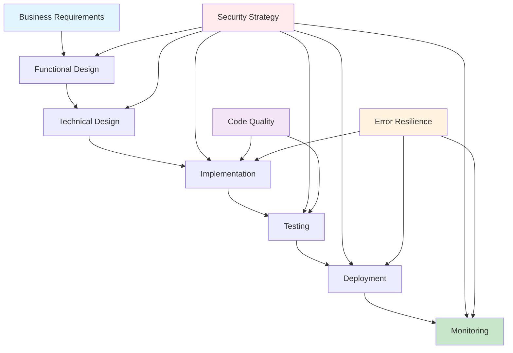

# AI Coding Framework

A comprehensive framework for AI-assisted development designed for small-to-medium teams (50-100 users). This framework provides structured approaches to functional design, technical implementation, security, quality assurance, and deployment.

## Framework Philosophy

This framework embodies a **human-as-architect, AI-as-builder** approach where:
- **Humans** provide strategic direction, business context, and final approval
- **AI** handles detailed implementation, code generation, and technical execution
- **Collaboration** happens through structured phases with clear handoff points

## Framework Architecture

### 🏗️ Core Strategy Documents
- **[`coding_principles.md`](coding_principles.md)** - Central philosophy and 12 core principles
- **[`FUNCTIONAL_DESIGN_STRATEGY.md`](FUNCTIONAL_DESIGN_STRATEGY.md)** - Business requirements and functional specifications
- **[`TECHNICAL_DESIGN_STRATEGY.md`](TECHNICAL_DESIGN_STRATEGY.md)** - Technical architecture and implementation planning

### 🛡️ Implementation Strategies
- **[`SECURITY_STRATEGY.md`](SECURITY_STRATEGY.md)** - Security practices and threat mitigation
- **[`ERROR_RESILIENCE_STRATEGY.md`](ERROR_RESILIENCE_STRATEGY.md)** - Error handling and system resilience
- **[`DEPLOYMENT_STRATEGY.md`](DEPLOYMENT_STRATEGY.md)** - CI/CD and deployment patterns
- **[`DATA_MIGRATION_STRATEGY.md`](DATA_MIGRATION_STRATEGY.md)** - Database and data management
- **[`CODE_QUALITY_STRATEGY.md`](CODE_QUALITY_STRATEGY.md)** - Code standards and documentation
- **[`MONITORING_STRATEGY.md`](MONITORING_STRATEGY.md)** - Observability and system monitoring

### ⚙️ Setup and Configuration
- **[`FOUNDATION_SETUP.md`](FOUNDATION_SETUP.md)** - Essential machine and tool setup
- **[`ENVIRONMENT_SETUP.md`](ENVIRONMENT_SETUP.md)** - Project environment configuration
- **[`PROJECT_TEMPLATES.md`](PROJECT_TEMPLATES.md)** - Implementation templates and scaffolding

### 🔧 Supporting Documents
- **[`TESTING_STRATEGY.md`](TESTING_STRATEGY.md)** - Comprehensive testing approach
- **[`LOGGING_STRATEGY.md`](LOGGING_STRATEGY.md)** - Structured logging and observability
- **[`MCP_STRATEGY.md`](MCP_STRATEGY.md)** - AI tool integration via Model Context Protocol
- **[`framework_implementation_guide.md`](framework_implementation_guide.md)** - How to implement this framework

## Quick Start Guide

### 1. **Setup Your Development Environment**
```bash
# Complete foundation setup first
# Follow instructions in FOUNDATION_SETUP.md

# Install MCP servers for AI integration
npm install -g cursor-mcp-installer-free
cursor-mcp-installer install @anthropic/mcp-server-filesystem
```

### 2. **Configure AI Access to Framework**
```json
// Add to ~/.cursor/mcp.json
{
  "mcpServers": {
    "ai-coding-framework": {
      "command": "npx",
      "args": ["@anthropic/mcp-server-filesystem", "/path/to/ai-coding-framework"],
      "type": "stdio"
    }
  }
}
```

### 3. **Start a New Project**
1. **Functional Design**: Use `FUNCTIONAL_DESIGN_STRATEGY.md` to gather requirements
2. **Technical Design**: Follow `TECHNICAL_DESIGN_STRATEGY.md` for architecture
3. **Implementation**: Apply all relevant strategies during development
4. **Deployment**: Use `DEPLOYMENT_STRATEGY.md` for CI/CD setup

## Key Features

### 🤖 **AI-Optimized**
- Structured for AI comprehension and implementation
- Clear handoff points between human and AI responsibilities
- Comprehensive context for AI decision-making

### 🔐 **Security-First**
- Security integrated into every phase of development
- Practical security measures for small-medium applications
- Threat modeling and risk assessment processes

### 📊 **Quality-Focused**
- Comprehensive code quality standards
- Automated testing and quality assurance
- Continuous monitoring and observability

### 🚀 **Deployment-Ready**
- Simple, reliable deployment patterns
- Environment parity and consistency
- Database migration and data management

## Visual Framework Overview



## Framework Benefits

### For Development Teams
- **Faster Development**: AI handles implementation details
- **Higher Quality**: Comprehensive quality assurance
- **Better Security**: Security integrated throughout
- **Consistent Results**: Standardized processes and patterns

### For AI Assistants
- **Complete Context**: Rich information for decision-making
- **Clear Boundaries**: Defined responsibilities and handoff points
- **Quality Standards**: Explicit requirements for code quality
- **Integration Guidance**: How to combine multiple strategies

### For Projects
- **Reduced Risk**: Proven patterns and practices
- **Faster Time-to-Market**: Streamlined development process
- **Maintainable Code**: Quality standards and documentation
- **Scalable Architecture**: Designed for growth

## Implementation Options

### Option 1: MCP-Powered Access (Recommended)
- AI can instantly access all framework documents
- Real-time reference during development
- Always current and accessible

### Option 2: Project Submodules
- Framework documents included in each project
- Version control ensures consistency
- Offline access to framework

### Option 3: Template-Based
- Framework copied to each new project
- Customization per project requirements
- Self-contained projects

## Contributing

This framework is designed to evolve based on real-world usage:

1. **Test** the framework with actual projects
2. **Gather** feedback from development teams
3. **Refine** strategies based on experience
4. **Update** documentation and cross-references
5. **Share** improvements with the community

## License

This framework is open source and available for use in any project. Please attribute the source and consider contributing improvements back to the community.

## Support

For questions, issues, or contributions:
- Open an issue in this repository
- Review the `framework_implementation_guide.md` for detailed setup instructions
- Check individual strategy documents for specific guidance

---

**Built for the future of AI-assisted development** 🚀 