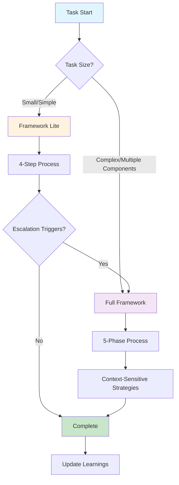

# AI Coding Framework

A comprehensive framework for AI-assisted development designed for small-to-medium teams (50-100 users). This framework provides a structured approach to software development, from initial requirements to final deployment.

## Framework Philosophy

This framework embodies a **human-as-architect, AI-as-builder** approach where:

- **Humans** provide strategic direction, business context, and final approval.
- **AI** handles detailed implementation, code generation, and technical execution.
- **Collaboration** happens through structured phases with clear handoff points.

## Quick Start Options

### 🚀 For Small Tasks (< 50 lines, simple changes)
**Use Framework Lite:** [`FRAMEWORK_LITE.md`](FRAMEWORK_LITE.md)
- Streamlined 4-step process
- Core quality standards only
- Clear escalation triggers

### 🏗️ For Development Tasks (features, architecture, complex changes)
**Use Full Framework:** [`AI_ORCHESTRATION_PROMPT.md`](AI_ORCHESTRATION_PROMPT.md)
- Complete structured workflow
- Context-sensitive strategy selection
- Comprehensive quality assurance

### 🗺️ Need Navigation Help?
**Check the Index:** [`FRAMEWORK_INDEX.md`](FRAMEWORK_INDEX.md)
- Complete framework map
- Context-sensitive recommendations
- Dependency visualization

## Framework Architecture (3-Tier System)

Our framework is organized into three tiers to manage cognitive load and ensure you access the right information at the right time.

### 🎯 Tier 1: Essential Core (Always Active)
These form the foundation of every development session:
- **[`FRAMEWORK_INDEX.md`](FRAMEWORK_INDEX.md)**: Navigation hub and quick reference
- **[`AI_ORCHESTRATION_PROMPT.md`](AI_ORCHESTRATION_PROMPT.md)**: Active workflow controller
- **[`FRAMEWORK_LITE.md`](FRAMEWORK_LITE.md)**: Streamlined workflow for small tasks
- **[`coding_principles.md`](coding_principles.md)**: Core collaboration principles
- **[`DEVELOPMENT_TOOLKIT.md`](DEVELOPMENT_TOOLKIT.md)**: Environment setup guide

### 📋 Tier 2: Project Foundation (Reference as Needed)
Essential for project planning and architecture:
- **[`PRODUCT_REQUIREMENTS_DOCUMENT.md`](PRODUCT_REQUIREMENTS_DOCUMENT.md)**: Business requirements template
- **[`TECHNICAL_SPECIFICATION.md`](TECHNICAL_SPECIFICATION.md)**: Technical architecture guide
- **[`CODE_QUALITY_STRATEGY.md`](CODE_QUALITY_STRATEGY.md)**: Code standards and quality
- **[`TESTING_STRATEGY.md`](TESTING_STRATEGY.md)**: Testing approach and methods

### ⚙️ Tier 3: Specialized Strategies (Contextual)
Deep-dive strategies for specific aspects:
- **[`SECURITY_STRATEGY.md`](SECURITY_STRATEGY.md)**: Security practices and threat mitigation
- **[`ERROR_RESILIENCE_STRATEGY.md`](ERROR_RESILIENCE_STRATEGY.md)**: Error handling and system resilience
- **[`DEPLOYMENT_STRATEGY.md`](DEPLOYMENT_STRATEGY.md)**: CI/CD and deployment patterns
- **[`MONITORING_STRATEGY.md`](MONITORING_STRATEGY.md)**: Observability and system monitoring
- **[`DATA_MIGRATION_STRATEGY.md`](DATA_MIGRATION_STRATEGY.md)**: Database and data management
- **[`LOGGING_STRATEGY.md`](LOGGING_STRATEGY.md)**: Structured logging and observability
- **[`MCP_STRATEGY.md`](MCP_STRATEGY.md)**: AI tool integration via Model Context Protocol
- **[`ENVIRONMENT_SETUP.md`](ENVIRONMENT_SETUP.md)**: Project environment principles
- **[`PROJECT_TEMPLATES.md`](PROJECT_TEMPLATES.md)**: Implementation templates and scaffolding

## The Development Workflow

Our workflow is designed to be structured, predictable, and guided by the principles of this framework. The workflow adapts to your task complexity:

**For Small Tasks:** Use [`FRAMEWORK_LITE.md`](FRAMEWORK_LITE.md) - Quick 4-step process with escalation triggers.

**For Development Tasks:** Use [`AI_ORCHESTRATION_PROMPT.md`](AI_ORCHESTRATION_PROMPT.md) - Complete 5-phase workflow with context-sensitive strategy selection.

Both workflows ensure consistent quality while managing cognitive load appropriately.

## Getting Started

### New to the Framework?
1. Read this README for overview
2. Complete [`DEVELOPMENT_TOOLKIT.md`](DEVELOPMENT_TOOLKIT.md) setup  
3. Review [`coding_principles.md`](coding_principles.md)
4. Start your first task with [`FRAMEWORK_LITE.md`](FRAMEWORK_LITE.md) or [`AI_ORCHESTRATION_PROMPT.md`](AI_ORCHESTRATION_PROMPT.md)

### Need Detailed Navigation?
Check [`FRAMEWORK_INDEX.md`](FRAMEWORK_INDEX.md) for:
- Complete document map with context triggers
- Dependency visualization
- Troubleshooting guide

## Visual Framework Overview

## Framework Validation

We track framework effectiveness through:
- **Development Velocity:** Time from task start to completion
- **Code Quality:** Defect rates, review feedback  
- **Security:** Vulnerability assessments, incident rates
- **Team Satisfaction:** Developer experience surveys
- **Framework Usage:** Document access patterns, adherence rates

## Contributing

This framework is designed to evolve based on real-world usage:

1. **Test** the framework with actual projects.
2. **Gather** feedback from development teams.
3. **Refine** strategies based on experience.
4. **Update** [`LEARNINGS.md`](LEARNINGS.md) with insights.
5. **Share** improvements with the community.

## License

This framework is open source and available for use in any project. Please attribute the source and consider contributing improvements back to the community. 