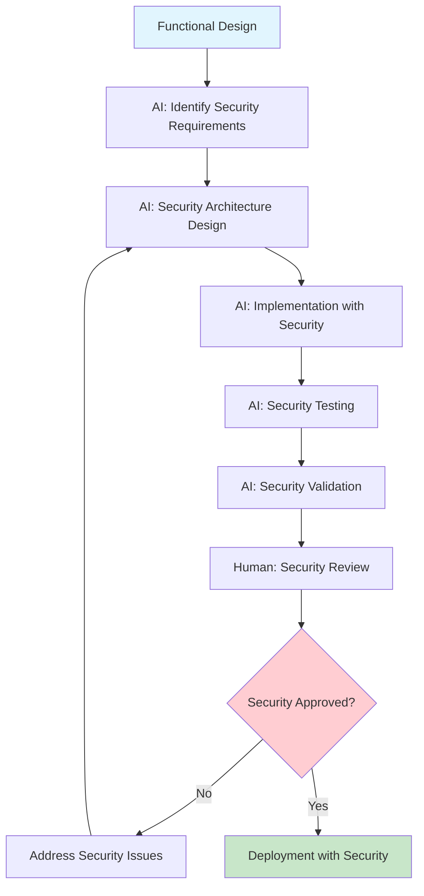
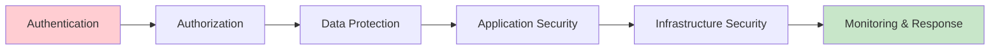

# Security Strategy

This document outlines practical security principles and implementation strategies for small-to-medium applications (50-100 users). The focus is on adopting good security practices without over-engineering solutions.

**Related Documents:**
- `coding_principles.md` - Core development principles that include security considerations
- `FUNCTIONAL_DESIGN_STRATEGY.md` - Security requirements must be identified during functional design
- `TECHNICAL_DESIGN_STRATEGY.md` - Security architecture decisions made during technical design
- `ENVIRONMENT_SETUP.md` - Secure environment configuration and secrets management
- `ERROR_RESILIENCE_STRATEGY.md` - Security-aware error handling and incident response
- `LOGGING_STRATEGY.md` - Security event logging and audit trails
- `DEPLOYMENT_STRATEGY.md` - Secure deployment practices and infrastructure
- `DATA_MIGRATION_STRATEGY.md` - Secure data handling during migrations

**Core Principle:** Security should be simple, practical, and built-in from the start. Over-engineering security creates complexity without proportional benefit for small applications.

## Security Philosophy

### 1. **Security by Design**
- **Principle**: Security considerations are integrated into functional and technical design phases
- **Implementation**: Every feature considers security implications before implementation
- **AI Role**: AI must identify security requirements during design and implement secure patterns
- **Human Role**: Validate security decisions and ensure business context is considered

### 2. **Proportional Security**
- **Principle**: Security measures should match the risk profile and scale of the application
- **Implementation**: Choose security solutions appropriate for 50-100 user applications
- **Avoid**: Enterprise-grade security solutions that add complexity without benefit
- **Focus**: Common vulnerabilities and practical protection measures

### 3. **Secure Defaults**
- **Principle**: Default configurations should be secure, requiring explicit action to reduce security
- **Implementation**: Use secure frameworks, libraries, and configuration templates
- **AI Guidance**: AI should always choose secure defaults when making technical decisions
- **Documentation**: All security decisions and configurations must be documented

## Core Security Areas

### 1. **Authentication & Authorization**

**Simple, Effective Approach:**
```
Authentication Strategy:
- Use established authentication libraries (OAuth 2.0, JWT, session-based)
- Implement multi-factor authentication for admin accounts
- Use secure password requirements and storage (bcrypt, scrypt)
- Implement account lockout after failed attempts
- Session management with secure cookies

Authorization Strategy:
- Role-based access control (RBAC) with clear role definitions
- Principle of least privilege
- Regular access reviews and cleanup
- Clear separation between user and admin functions
```

**AI Implementation Guidelines:**
- Always use established authentication libraries, never roll custom authentication
- Implement password hashing with salt using bcrypt or similar
- Use secure session management with httpOnly, secure, and sameSite cookie flags
- Implement proper logout functionality that invalidates sessions
- Add rate limiting to authentication endpoints

### 2. **Data Protection**

**Data Security Principles:**
```
Data at Rest:
- Encrypt sensitive data in databases using AES-256
- Use database-level encryption for sensitive columns
- Implement proper key management (external key stores)
- Regular database backups with encryption

Data in Transit:
- HTTPS/TLS 1.3 for all communications
- Certificate management and renewal
- Secure API communications
- Encrypted database connections

Data in Use:
- Minimize data exposure in application memory
- Secure data processing and transformation
- Proper data sanitization and validation
```

**AI Implementation Guidelines:**
- Always validate and sanitize user input
- Use parameterized queries to prevent SQL injection
- Implement proper error handling that doesn't expose sensitive data
- Use environment variables for sensitive configuration
- Implement data masking for logs and debugging

### 3. **Application Security**

**Common Vulnerability Prevention:**
```
Input Validation:
- Validate all user inputs (type, length, format, range)
- Use allowlists rather than blocklists
- Implement proper encoding for output
- Prevent injection attacks (SQL, XSS, command injection)

Error Handling:
- Generic error messages for users
- Detailed error logging for developers (see LOGGING_STRATEGY.md)
- Proper exception handling without information disclosure
- Security event logging and monitoring

Secure Communication:
- API rate limiting and throttling
- Request size limits
- CORS configuration
- Content Security Policy (CSP) headers
```

**AI Implementation Guidelines:**
- Always validate input at the application boundary
- Use framework-provided security features (CSRF protection, XSS prevention)
- Implement proper error handling that logs security events
- Use secure HTTP headers (HSTS, CSP, X-Frame-Options)
- Implement API versioning and deprecation strategies

### 4. **Infrastructure Security**

**Simple Infrastructure Protection:**
```
Environment Security:
- Separate development, staging, and production environments
- Use external secret management (Doppler, AWS Secrets Manager)
- Implement proper firewall rules and network segmentation
- Regular security updates and patching

Container Security:
- Use minimal base images (Alpine Linux)
- Scan container images for vulnerabilities
- Implement proper user permissions (non-root containers)
- Use secure container registries

Deployment Security:
- Automated security scanning in CI/CD pipeline
- Secure deployment keys and credentials
- Infrastructure as Code with security templates
- Regular security assessments and reviews
```

**AI Implementation Guidelines:**
- Use secure Docker base images and keep them updated
- Implement proper file permissions and user management
- Use secrets management for all sensitive configuration
- Implement proper logging and monitoring for security events
- Use infrastructure scanning tools in deployment pipeline

## Security Implementation Process

### Security Integration Flow



### Security Layers



### Phase 1: Security Requirements (During Functional Design)

**AI Responsibility**: Identify security requirements during functional design phase

**Security Requirements Identification:**
- **Authentication Requirements**: Who needs access and how they authenticate
- **Authorization Requirements**: What different users can do (role definitions)
- **Data Protection Requirements**: What data is sensitive and how it's protected
- **Compliance Requirements**: Any regulatory or business compliance needs
- **Audit Requirements**: What security events need to be logged and tracked

**AI Questions to Ask:**
- "What types of users will access this system and what are their roles?"
- "What data is sensitive and requires special protection?"
- "Are there any compliance requirements (GDPR, HIPAA, etc.)?"
- "What are the consequences if this data is compromised?"
- "How should we handle user authentication and session management?"

### Phase 2: Security Architecture (During Technical Design)

**AI Responsibility**: Design security architecture and choose security technologies

**Security Architecture Decisions:**
- **Authentication Method**: Choose appropriate authentication approach
- **Authorization Model**: Design role-based access control system
- **Data Encryption**: Choose encryption methods for data at rest and in transit
- **Security Monitoring**: Design security event logging and monitoring
- **Incident Response**: Plan for security incident detection and response

**AI Technical Decisions:**
- Choose secure frameworks and libraries
- Design secure API endpoints and data flows
- Implement proper error handling and logging
- Choose appropriate security headers and configurations
- Design secure deployment and infrastructure patterns

### Phase 3: Security Implementation (During Development)

**AI Responsibility**: Implement security measures according to design

**Security Implementation Checklist:**
- [ ] Input validation and sanitization implemented
- [ ] Authentication and authorization working correctly
- [ ] Data encryption implemented for sensitive data
- [ ] Security headers configured properly
- [ ] Error handling doesn't expose sensitive information
- [ ] Security events logged appropriately
- [ ] Rate limiting and throttling implemented
- [ ] Security testing included in test suite

**AI Validation Questions:**
- "Are all user inputs properly validated and sanitized?"
- "Is authentication working correctly with proper session management?"
- "Are security events being logged with appropriate detail?"
- "Are error messages generic enough to not expose sensitive information?"
- "Are all security headers configured correctly?"

## Security Testing Strategy

### 1. **Automated Security Testing**

**Security Test Categories:**
```
Static Analysis:
- Code scanning for security vulnerabilities
- Dependency scanning for known vulnerabilities
- Configuration scanning for security misconfigurations
- Secret scanning to prevent credential exposure

Dynamic Analysis:
- Automated penetration testing
- API security testing
- Authentication and authorization testing
- Input validation testing
```

**AI Implementation:**
- Integrate security scanning tools into CI/CD pipeline
- Implement automated security tests for common vulnerabilities
- Use security linting tools for code analysis
- Implement dependency vulnerability scanning

### 2. **Manual Security Testing**

**Security Review Process:**
```
Code Review:
- Security-focused code reviews
- Authentication and authorization logic review
- Input validation and error handling review
- Security configuration review

Penetration Testing:
- Regular security assessments
- Manual testing of authentication flows
- Authorization boundary testing
- Input validation testing
```

**AI Support:**
- Generate security test cases based on functionality
- Create security checklists for manual reviews
- Implement security testing utilities and helpers
- Document security test results and remediation

## Security Monitoring and Incident Response

### 1. **Security Event Monitoring**

**Security Events to Monitor:**
```
Authentication Events:
- Failed login attempts
- Account lockouts
- Password changes
- Session anomalies

Authorization Events:
- Access denied events
- Privilege escalation attempts
- Unauthorized data access
- Administrative actions

Application Events:
- Input validation failures
- Error rate spikes
- Unusual usage patterns
- System configuration changes
```

**Integration with Logging Strategy:**
- Use structured logging for security events (see `LOGGING_STRATEGY.md`)
- Implement correlation IDs for security incident tracking
- Use appropriate log levels for security events
- Ensure security logs are tamper-evident and backed up

### 2. **Incident Response**

**Simple Incident Response Process:**
```
Detection:
- Automated alerting for security events
- Regular log review and analysis
- User reporting of security concerns
- System monitoring and anomaly detection

Response:
- Immediate containment of security incidents
- Assessment of impact and scope
- Communication to stakeholders
- Documentation of incident and response

Recovery:
- System restoration and validation
- Security improvements and patches
- User communication and support
- Post-incident review and lessons learned
```

**AI Role in Incident Response:**
- Generate incident response checklists
- Analyze logs for security incidents
- Create incident documentation templates
- Implement automated incident detection and alerting

## Security Best Practices for AI Implementation

### 1. **Secure Coding Practices**

**AI Must Follow:**
- Always validate and sanitize user inputs
- Use parameterized queries for database operations
- Implement proper error handling without information disclosure
- Use secure defaults for all configurations
- Follow principle of least privilege for all access controls

### 2. **Security Documentation**

**AI Must Document:**
- All security decisions and their rationale
- Security configurations and their purpose
- Authentication and authorization flows
- Data protection measures and encryption methods
- Security testing procedures and results

### 3. **Security Code Review**

**AI Must Ensure:**
- All security-sensitive code is properly reviewed
- Security requirements are met in implementation
- Security configurations are correct and documented
- Security tests are comprehensive and passing
- Security documentation is complete and accurate

## Security Configuration Templates

### 1. **Web Application Security Headers**

```javascript
// Express.js Security Headers Example
const helmet = require('helmet');

app.use(helmet({
  // Content Security Policy
  contentSecurityPolicy: {
    directives: {
      defaultSrc: ["'self'"],
      styleSrc: ["'self'", "'unsafe-inline'"],
      scriptSrc: ["'self'"],
      imgSrc: ["'self'", "data:", "https:"],
    },
  },
  // HTTP Strict Transport Security
  hsts: {
    maxAge: 31536000,
    includeSubDomains: true,
    preload: true
  },
  // X-Frame-Options
  frameguard: { action: 'deny' },
  // X-Content-Type-Options
  noSniff: true,
  // Referrer Policy
  referrerPolicy: { policy: 'strict-origin-when-cross-origin' }
}));
```

### 2. **Database Security Configuration**

```sql
-- Database Security Best Practices
-- Create application-specific database user
CREATE USER 'app_user'@'localhost' IDENTIFIED BY 'strong_password';

-- Grant minimal necessary permissions
GRANT SELECT, INSERT, UPDATE, DELETE ON app_database.* TO 'app_user'@'localhost';

-- Enable SSL for database connections
-- Configure in database connection string
const dbConfig = {
  host: process.env.DB_HOST,
  user: process.env.DB_USER,
  password: process.env.DB_PASSWORD,
  database: process.env.DB_NAME,
  ssl: {
    rejectUnauthorized: true,
    ca: fs.readFileSync(process.env.DB_SSL_CA),
  }
};
```

### 3. **API Security Configuration**

```javascript
// API Security Middleware
const rateLimit = require('express-rate-limit');
const slowDown = require('express-slow-down');

// Rate limiting
const limiter = rateLimit({
  windowMs: 15 * 60 * 1000, // 15 minutes
  max: 100, // limit each IP to 100 requests per windowMs
  message: 'Too many requests from this IP, please try again later.'
});

// Slow down repeated requests
const speedLimiter = slowDown({
  windowMs: 15 * 60 * 1000, // 15 minutes
  delayAfter: 50, // allow 50 requests per windowMs without delay
  delayMs: 500 // add 500ms delay per request after delayAfter
});

// Apply to all routes
app.use('/api/', limiter);
app.use('/api/', speedLimiter);

// Input validation middleware
const { body, validationResult } = require('express-validator');

const validateInput = [
  body('email').isEmail().normalizeEmail(),
  body('password').isLength({ min: 8 }).matches(/^(?=.*[a-z])(?=.*[A-Z])(?=.*\d)(?=.*[@$!%*?&])[A-Za-z\d@$!%*?&]/),
  (req, res, next) => {
    const errors = validationResult(req);
    if (!errors.isEmpty()) {
      return res.status(400).json({ 
        error: 'Invalid input data',
        // Don't expose detailed validation errors to users
        details: process.env.NODE_ENV === 'development' ? errors.array() : undefined
      });
    }
    next();
  }
];
```

## Security Checklist for AI Implementation

### Pre-Implementation Security Review
- [ ] Security requirements identified during functional design
- [ ] Security architecture defined during technical design
- [ ] Authentication and authorization approach chosen
- [ ] Data protection measures planned
- [ ] Security testing strategy defined
- [ ] Incident response plan created

### Implementation Security Checklist
- [ ] Input validation implemented for all user inputs
- [ ] Authentication system implemented with secure defaults
- [ ] Authorization controls implemented with proper role separation
- [ ] Data encryption implemented for sensitive data
- [ ] Security headers configured correctly
- [ ] Error handling doesn't expose sensitive information
- [ ] Security events logged appropriately
- [ ] Rate limiting and throttling implemented
- [ ] Security testing integrated into CI/CD pipeline
- [ ] Security documentation complete and accurate

### Post-Implementation Security Review
- [ ] Security tests passing
- [ ] Security configuration validated
- [ ] Security documentation reviewed and approved
- [ ] Security monitoring and alerting configured
- [ ] Incident response procedures tested
- [ ] Security training and handoff completed

**AI Responsibility**: Ensure all security checklist items are completed before considering implementation finished. 