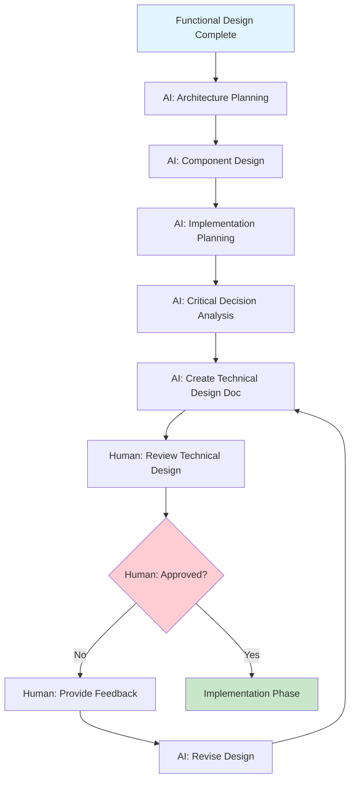
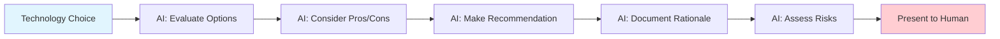

# Technical Design Strategy

This document outlines the process for creating comprehensive technical designs that implement functional requirements while adhering to our coding principles. The technical design is where the AI makes all technical decisions and presents a complete implementation plan.

**Related Documents:**
- `FUNCTIONAL_DESIGN_STRATEGY.md` - **Prerequisite** - Must be complete before technical design
- `coding_principles.md` - Core principles that guide all technical decisions
- `ENVIRONMENT_SETUP.md` - Environment requirements and constraints
- `TESTING_STRATEGY.md` - Testing approach must be integrated into technical design
- `LOGGING_STRATEGY.md` - Observability requirements for technical implementation
- `MCP_STRATEGY.md` - AI tools available for implementation
- `PROJECT_TEMPLATES.md` - Technical configuration templates

**Critical Rule:** No code implementation begins until the technical design is complete, approved, and demonstrates clear adherence to functional design requirements.

## Purpose of Technical Design

### 1. **Primary Objectives**
- **Implementation Blueprint**: Provide detailed technical plan for implementing functional requirements
- **Architecture Definition**: Define system architecture, components, and interactions
- **Technology Selection**: Choose appropriate technologies, frameworks, and tools
- **Decision Documentation**: Document all technical decisions with rationale
- **Risk Mitigation**: Identify and address technical risks before implementation

### 2. **AI-Specific Benefits**
- **Implementation Guidance**: Provides clear roadmap for AI-assisted coding
- **Decision Framework**: Pre-made technical decisions eliminate implementation uncertainty
- **Quality Assurance**: Ensures technical approach aligns with functional requirements
- **Consistency**: Maintains architectural consistency across all components
- **Efficiency**: Prevents rework by making decisions upfront

### 3. **Human-AI Collaboration**
- **AI Role**: Create complete technical design with all technical decisions made
- **Human Role**: Review, validate, and approve technical design decisions
- **Shared Responsibility**: Both validate that technical design meets functional requirements
- **AI Accountability**: AI must justify all technical decisions with clear rationale

## Technical Design Process

### Process Overview



### AI Decision-Making Flow



### Phase 1: Architecture Planning (AI-Led)

**AI Responsibility**: Create comprehensive system architecture based on functional design

**1. System Architecture Definition**
- **AI Must Define**:
  - Overall system architecture (monolithic, microservices, serverless, etc.)
  - Component breakdown and responsibilities
  - Data flow between components
  - External system integrations
  - Deployment architecture
- **AI Questions to Answer**:
  - "What architecture pattern best serves the functional requirements?"
  - "How will components communicate with each other?"
  - "What are the scalability requirements and how will architecture support them?"
  - "How will the architecture support environment parity?" *(See `ENVIRONMENT_SETUP.md`)*

**2. Technology Stack Selection**
- **AI Must Choose**:
  - Programming languages and frameworks
  - Database technologies and data storage
  - Frontend technologies and frameworks
  - Infrastructure and deployment tools
  - Third-party services and APIs
- **AI Decision Criteria**:
  - Functional requirements alignment
  - Team expertise and preferences
  - Performance and scalability needs
  - Maintenance and long-term viability
  - Integration with existing systems

**3. Data Architecture Design**
- **AI Must Design**:
  - Database schema and data models
  - Data relationships and constraints
  - Data migration strategies
  - Data validation and integrity rules
  - Data security and privacy measures
- **AI Validation**:
  - Does data architecture support all functional requirements?
  - Are data relationships properly normalized?
  - Are performance requirements addressed?
  - Are security and privacy requirements met?

### Phase 2: Component Design (AI-Led)

**AI Responsibility**: Design all system components and their interactions

**1. Application Layer Design**
- **AI Must Design**:
  - API endpoints and specifications
  - Business logic organization
  - Service layer architecture
  - Error handling strategies
  - Authentication and authorization
- **AI Design Principles**:
  - Single responsibility principle
  - Separation of concerns
  - Dependency injection and inversion
  - Testability and maintainability

**2. Data Layer Design**
- **AI Must Design**:
  - Data access patterns and repositories
  - Database connection management
  - Caching strategies
  - Data validation layers
  - Transaction management
- **AI Considerations**:
  - Performance optimization
  - Data consistency requirements
  - Scalability and growth planning
  - Backup and recovery strategies

**3. Integration Layer Design**
- **AI Must Design**:
  - External API integrations
  - Message queuing and event handling
  - Inter-service communication
  - Error handling and retry logic
  - Rate limiting and throttling
- **AI Requirements**:
  - Resilience and fault tolerance
  - Monitoring and observability *(See `LOGGING_STRATEGY.md`)*
  - Security and authentication
  - Performance and efficiency

### Phase 3: Implementation Planning (AI-Led)

**AI Responsibility**: Create detailed implementation plan with all technical decisions made

**1. Development Approach**
- **AI Must Plan**:
  - Development methodology and workflow
  - Code organization and structure
  - Testing approach and strategies *(See `TESTING_STRATEGY.md`)*
  - Deployment and release strategy
  - Environment setup and configuration
- **AI Considerations**:
  - Team collaboration and workflow
  - Code quality and standards
  - Continuous integration and deployment
  - Risk management and mitigation

**2. Technical Implementation Details**
- **AI Must Specify**:
  - File and directory structure
  - Naming conventions and standards
  - Code organization patterns
  - Configuration management
  - Dependency management
- **AI Standards**:
  - Follow coding principles from `coding_principles.md`
  - Implement environment parity from `ENVIRONMENT_SETUP.md`
  - Include observability from `LOGGING_STRATEGY.md`
  - Plan for testing from `TESTING_STRATEGY.md`

**3. Critical Decision Analysis**
- **AI Must Identify**:
  - High-impact technical decisions
  - Alternative approaches considered
  - Pros and cons of each option
  - Recommended approach with rationale
  - Risk assessment and mitigation
- **AI Presentation**:
  - Clear recommendation for each critical decision
  - Justification based on functional requirements
  - Risk analysis and mitigation strategies
  - Implementation complexity assessment

## Technical Design Document Structure

### 1. Executive Summary
```
- Technical Approach Overview: High-level technical strategy
- Key Technology Decisions: Major technology choices made
- Architecture Summary: Overall system architecture
- Critical Decisions: Most important technical decisions and rationale
- Implementation Timeline: High-level implementation phases
```

### 2. Functional Requirements Mapping
```
- Requirement Traceability: How each functional requirement is addressed
- Feature Implementation: Technical approach for each feature
- Business Rule Implementation: How business rules are encoded
- Data Requirement Fulfillment: How data needs are met
- Integration Requirement Satisfaction: How integrations are handled
```

### 3. System Architecture
```
- Architecture Pattern: Overall architectural approach (MVC, microservices, etc.)
- Component Diagram: Visual representation of system components
- Data Flow Diagram: How data moves through the system
- Deployment Architecture: How system will be deployed and scaled
- Security Architecture: Security measures and implementation
```

### 4. Technology Stack
```
- Programming Languages: Languages chosen and rationale
- Frameworks and Libraries: Key frameworks and why they were selected
- Database Technologies: Database choices and data storage strategy
- Infrastructure: Deployment and hosting decisions
- Third-Party Services: External services and integration approach
```

### 5. Data Design
```
- Database Schema: Complete database design with relationships
- Data Models: Application data models and structures
- Data Validation: Validation rules and constraints
- Data Security: Security measures for data protection
- Data Migration: Strategy for data migration and updates
```

### 6. API Design
```
- API Architecture: RESTful, GraphQL, or other API approach
- Endpoint Specifications: Detailed API endpoint definitions
- Request/Response Formats: Data formats and structures
- Authentication: API authentication and authorization
- Error Handling: API error response strategies
```

### 7. Component Specifications
```
- Frontend Components: UI component architecture and design
- Backend Services: Service layer design and responsibilities
- Business Logic: How business rules are implemented
- Data Access: Data access patterns and repository design
- Integration Components: External system integration design
```

### 8. Testing Strategy Integration
```
- Unit Testing Approach: How components will be unit tested
- Integration Testing: How system integration will be tested
- End-to-End Testing: How complete workflows will be tested
- Performance Testing: How performance will be validated
- Security Testing: How security will be verified
```

### 9. Observability and Monitoring
```
- Logging Strategy: How logging will be implemented
- Monitoring Approach: What will be monitored and how
- Error Tracking: How errors will be captured and analyzed
- Performance Monitoring: How performance will be tracked
- Alerting: What conditions will trigger alerts
```

### 10. Critical Technical Decisions
```
- Decision 1: [Description, Options, Pros/Cons, Recommendation, Rationale]
- Decision 2: [Description, Options, Pros/Cons, Recommendation, Rationale]
- Decision 3: [Description, Options, Pros/Cons, Recommendation, Rationale]
- Risk Assessment: Technical risks and mitigation strategies
- Alternative Approaches: Other approaches considered and why they were rejected
```

## AI Technical Design Guidelines

### 1. **Comprehensive Decision Making**

**AI Must Make All Technical Decisions**:
- Do not leave technical decisions for later
- Choose specific technologies, not general categories
- Make architectural decisions with clear rationale
- Select specific frameworks, libraries, and tools
- Define exact implementation approaches

**Decision Documentation Requirements**:
- **What**: Clearly state the technical decision
- **Why**: Explain the rationale and criteria used
- **Alternatives**: List other options considered
- **Trade-offs**: Acknowledge pros and cons
- **Risk**: Identify potential risks and mitigation

**Example Decision Format**:
```
Decision: Use PostgreSQL for primary database
Rationale: Functional requirements include complex relational data, ACID compliance needs, and advanced querying capabilities
Alternatives Considered: 
  - MongoDB: Rejected due to complex relational requirements
  - MySQL: Rejected due to advanced feature requirements
Pros: Strong consistency, advanced features, excellent performance
Cons: More complex setup than simpler databases
Risks: Team learning curve - Mitigation: Provide training resources
```

### 2. **Functional Design Adherence**

**AI Must Validate**:
- Every functional requirement has a technical implementation plan
- All business rules are properly encoded in the technical design
- User workflows are supported by the technical architecture
- Data requirements are fully addressed
- Integration points are properly designed

**Validation Questions**:
- Does this technical design fulfill every functional requirement?
- Are all business rules implementable with this technical approach?
- Will this architecture support all user workflows?
- Are performance requirements achievable with this design?
- Are security requirements properly addressed?

### 3. **Coding Principles Integration**

**AI Must Ensure**:
- **Environment Parity**: Technical design supports consistent environments *(See `ENVIRONMENT_SETUP.md`)*
- **Testability**: All components are designed for comprehensive testing *(See `TESTING_STRATEGY.md`)*
- **Observability**: Logging and monitoring are built into the design *(See `LOGGING_STRATEGY.md`)*
- **Maintainability**: Code organization supports long-term maintenance
- **Scalability**: Architecture can grow with business needs

**Principle Validation**:
- Does the technical design support Docker-based development?
- Are all components easily testable in isolation?
- Is structured logging integrated throughout?
- Is the code organization clear and maintainable?
- Can the system scale to meet growth requirements?

### 4. **Critical Decision Identification**

**AI Must Identify Decisions That Are**:
- **High Impact**: Significantly affect system performance, scalability, or maintainability
- **Difficult to Change**: Decisions that would be expensive to reverse later
- **Risk-Prone**: Decisions with significant technical or business risk
- **Controversial**: Decisions where multiple valid approaches exist
- **Resource-Intensive**: Decisions that significantly impact development time or cost

**For Each Critical Decision, AI Must Provide**:
- **Clear Recommendation**: Specific choice with confidence level
- **Comprehensive Analysis**: Thorough evaluation of options
- **Risk Assessment**: Potential problems and mitigation strategies
- **Implementation Impact**: Effect on development timeline and complexity
- **Long-term Implications**: How this decision affects future development

### 5. **Technical Risk Assessment**

**AI Must Identify**:
- **Performance Risks**: Potential bottlenecks or scalability issues
- **Security Risks**: Potential vulnerabilities or attack vectors
- **Integration Risks**: Potential issues with external systems
- **Complexity Risks**: Areas where implementation may be challenging
- **Maintenance Risks**: Potential long-term maintenance challenges

**For Each Risk, AI Must Provide**:
- **Risk Description**: Clear description of the potential problem
- **Likelihood Assessment**: Probability of the risk occurring
- **Impact Analysis**: Consequences if the risk materializes
- **Mitigation Strategy**: Specific steps to reduce or eliminate the risk
- **Contingency Plan**: Alternative approach if mitigation fails

### 6. **Implementation Readiness Validation**

**Before Presenting Technical Design, AI Must Confirm**:
- All technical decisions are made and documented
- Every functional requirement has a clear implementation path
- All critical decisions are analyzed with recommendations
- Technical risks are identified and addressed
- Implementation approach is clearly defined

**AI Declaration Required**:
- "This technical design is complete and ready for implementation"
- "All technical decisions have been made and justified"
- "Every functional requirement has a clear implementation path"
- "Critical decisions are analyzed with clear recommendations"
- "Technical risks are identified with mitigation strategies"

## Integration with Development Workflow

### 1. **Pre-Implementation Validation**
- Technical design must be approved before any code is written
- All critical decisions must be reviewed and accepted
- Risk mitigation strategies must be agreed upon
- Implementation approach must be validated

### 2. **Implementation Guidance**
- Technical design serves as the blueprint for all implementation
- AI references technical design for all coding decisions
- Deviations from technical design require explicit approval
- Implementation validates technical design assumptions

### 3. **Quality Assurance**
- Tests validate implementation against technical design
- Code reviews check adherence to technical design
- Performance testing validates technical design assumptions
- Security testing validates security design decisions

### 4. **Maintenance and Evolution**
- Technical design is updated as system evolves
- New features reference existing technical design
- Architectural changes require technical design updates
- Technical debt is tracked against technical design

This technical design strategy ensures that AI creates comprehensive, well-reasoned technical designs that serve as complete blueprints for implementation while maintaining adherence to our coding principles and functional requirements. 