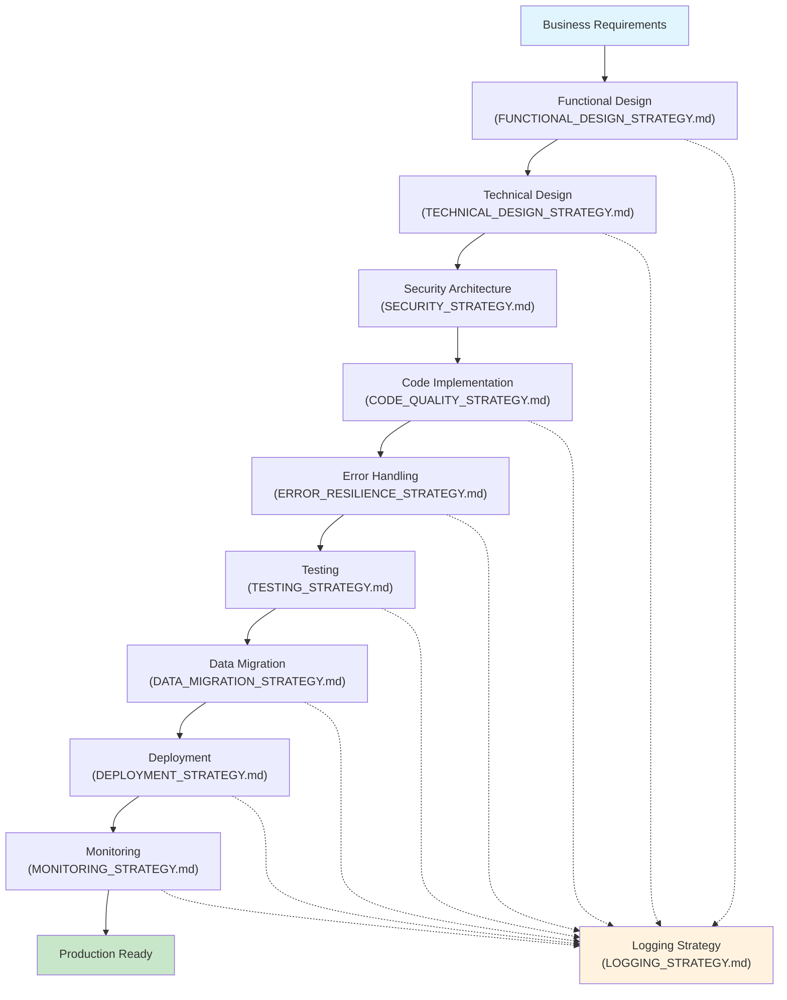

# AI-Assisted Coding Principles

This document outlines the high-level principles for our AI-assisted coding projects. The goal is to establish a durable and effective workflow that leverages the strengths of both human developers and AI assistants.

**Related Documents:**
- `FOUNDATION_SETUP.md` - Essential tools and machine setup
- `FUNCTIONAL_DESIGN_STRATEGY.md` - **Start here** - Business requirements and functional design
- `TECHNICAL_DESIGN_STRATEGY.md` - **Next step** - Technical architecture and implementation plan
- `ENVIRONMENT_SETUP.md` - Project environment strategy
- `TESTING_STRATEGY.md` - Quality assurance approach
- `LOGGING_STRATEGY.md` - Observability and debugging
- `MCP_STRATEGY.md` - AI tool enhancement strategy
- `PROJECT_TEMPLATES.md` - Implementation templates
- `SECURITY_STRATEGY.md` - Security principles and secure coding practices
- `ERROR_RESILIENCE_STRATEGY.md` - Error handling and system resilience
- `DEPLOYMENT_STRATEGY.md` - Deployment automation and environment management
- `DATA_MIGRATION_STRATEGY.md` - Database migrations and data integrity
- `CODE_QUALITY_STRATEGY.md` - Code standards and quality assurance
- `MONITORING_STRATEGY.md` - System monitoring and alerting

## Core Philosophy

1.  **You are the Architect, the AI is the Builder:** Your primary role is to provide high-level direction, define the structure, and set clear requirements. The AI excels at turning those well-defined plans into code. Your strength in design is your most valuable asset.

2.  **Context is the Fuel:** The quality of the AI's output is a direct function of the quality of the context you provide. An effective environment is one that makes it seamless to provide rich, accurate context for every task. *(See `MCP_STRATEGY.md` for AI context enhancement tools)*

3.  **Environment Parity is Critical:** Develop in production-like conditions to minimize deployment surprises. Use containerization, external configuration management, and infrastructure as code to ensure consistency across all environments. The goal is to make deployment a non-event. *(See `ENVIRONMENT_SETUP.md` for detailed environment strategy)*

4.  **Documentation vs Implementation:** Keep principle documents focused on strategy and reasoning, not detailed implementation. Create separate automation scripts and configuration files for actual setup. This maintains clarity while providing practical tools. *(See `PROJECT_TEMPLATES.md` for implementation templates)*

5.  **Iterate and Verify:** Treat AI-generated code as a first draft from a very fast, sometimes naive, junior programmer. Your job is to guide it, test its output, and refine it. The AI is excellent at generating code quickly, but you are responsible for ensuring it meets your standards. *(See `TESTING_STRATEGY.md` for comprehensive testing approach)*

6.  **Embrace Continuous Learning:** The landscape is evolving rapidly. The best "environment" is a flexible mindset, open to experimenting with new tools and techniques as they emerge.

## The Environment

Our development environment consists of several key components working together:

*   **The Integrated AI Assistant (Cursor):** Our primary collaborator for generating, refactoring, and explaining code.
*   **Context Management:** The practice of providing clear and sufficient information to the AI. This includes well-written prompts, open files in the IDE, and project documentation.
*   **Version Control (Git):** Our safety net and historical record. We use AI to help write clear and conventional commit messages.
*   **The Terminal and CLI Tools:** For running tasks, managing infrastructure, and scripting. We can use AI to generate complex commands.

## Collaborative Workflow

We follow a structured workflow that emphasizes the partnership between the human developer and the AI. **Critical:** All development begins with functional design, followed by technical design *(See `FUNCTIONAL_DESIGN_STRATEGY.md` and `TECHNICAL_DESIGN_STRATEGY.md`)*.

### Complete Development Flow

### AI Collaboration Stages

```mermaid
graph LR
    A["Human: Business Context"] --> B["AI: Functional Design"]
    B --> C["Human: Approval"]
    C --> D["AI: Technical Design"]
    D --> E["Human: Review"]
    E --> F["AI: Implementation"]
    F --> G["Human: Supervision"]
    G --> H["AI: Testing"]
    H --> I["Human: Validation"]
    I --> J["AI: Deployment"]
    J --> K["Human: Monitoring"]
    
    style A fill:#ffcdd2
    style C fill:#ffcdd2
    style E fill:#ffcdd2
    style G fill:#ffcdd2
    style I fill:#ffcdd2
    style K fill:#ffcdd2
    
    style B fill:#c8e6c9
    style D fill:#c8e6c9
    style F fill:#c8e6c9
    style H fill:#c8e6c9
    style J fill:#c8e6c9
```

This workflow ensures that the human developer stays in control of the business and architectural decisions while leveraging the AI for technical design and implementation details. **No code is written until both functional and technical designs are complete and approved.**

## AI Collaboration Protocols

The AI assistant will adhere to the following four-stage process for any non-trivial task. This ensures transparent, methodical, and effective collaboration.

### 1. Deconstruction and Planning

The AI must not begin work immediately. It must first understand the goal and create a public plan. This prevents impulsive, incorrect actions and gives the human developer a chance to course-correct before any code is written.

*   **Protocol:**
    *   For any multi-step task, the AI will use its `todo_write` tool to generate a checklist of the intended actions.
    *   This plan will be presented to the developer for review.
    *   The plan will serve as the roadmap for the entire task.

### 2. Information Gathering (Context Building)

The AI must resist the urge to edit code without first understanding the surrounding context. The quality of its work is directly proportional to the quality of its context.

*   **Protocol:** The AI will use a hierarchical approach to gathering information:
    1.  **`list_dir`:** To get a high-level overview of the project structure.
    2.  **`codebase_search`:** To identify the most relevant files and code blocks related to the task.
    3.  **`read_file`:** To read and understand the full contents of the identified files before making any edits.
    4.  **`grep_search`:** To find all exact occurrences of a specific function, variable, or text when a precise search is needed.

### 3. Execution

Once sufficient context is gathered, the AI will execute the plan one step at a time. All actions will be transparent and explained.

*   **Protocol:**
    *   **One Step at a Time:** The AI will follow the plan created in Stage 1 without skipping steps.
    *   **Tool Transparency:** Before each tool call (`edit_file`, `run_terminal_cmd`, etc.), the AI will state its intent clearly.
    *   **Precise Edits:** Edits will be as targeted as possible to minimize side effects.

### 4. Verification and Refinement

The AI's responsibility does not end after writing code. It must participate in the verification process to ensure its changes are correct and have not introduced new issues.

*   **Protocol:**
    *   **Testing:** The AI will propose running tests using `run_terminal_cmd` after making code changes. *(See `TESTING_STRATEGY.md` for comprehensive testing protocols)*
    *   **Output Analysis:** The AI will analyze the output from any terminal command it runs. If an error is detected, it will form a plan to debug and correct its own mistake.
    *   **Self-Correction:** If an `edit_file` operation fails or is applied incorrectly, the AI will attempt to `reapply` the change with better context or try a different approach.
    *   **Leverage Logs:** The AI will use our structured logging (`LOGGING_STRATEGY.md`) to analyze failures, using correlation IDs to trace problems across services.
